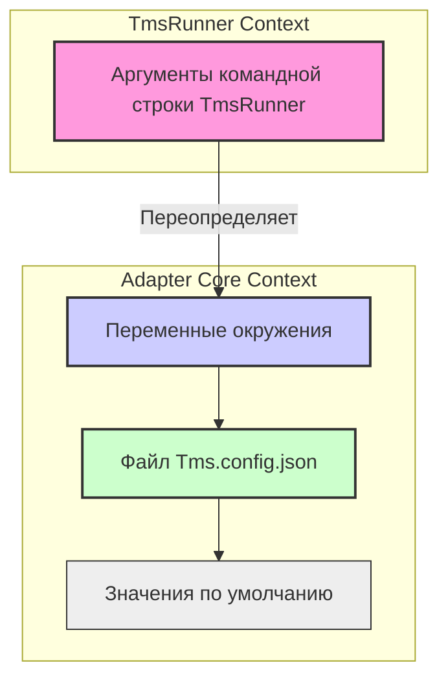

# Chapter 1: Конфигурация Адаптера


Добро пожаловать в мир `adapters-dotnet`! Прежде чем ваши автоматические тесты смогут отправлять результаты в Test IT, нам нужно настроить сам адаптер. Представьте, что вы собираете мебель из IKEA: у вас есть детали (тесты) и инструмент (адаптер), но без инструкции по сборке (конфигурации) ничего не получится.

**Конфигурация Адаптера** — это именно та "инструкция", которая говорит адаптеру, как подключиться к вашей системе Test IT и как ему следует себя вести. Без правильной настройки адаптер просто не будет знать, куда отправлять результаты тестов или как их обрабатывать.

## Зачем нужна конфигурация?

Основная задача адаптера — связать ваши автотесты с системой управления тестированием (TMS), в нашем случае — Test IT. Для этого ему нужна как минимум следующая информация:

1.  **Адрес Test IT (URL):** Куда нужно подключаться?
2.  **Секретный ключ (Private Token):** Как доказать, что у вас есть право доступа? Это как пароль для вашего адаптера.
3.  **Идентификатор проекта (Project ID):** В какой проект в Test IT отправлять результаты?
4.  **Идентификатор конфигурации (Configuration ID):** С какой тестовой конфигурацией (например, "Chrome, Windows 10" или "API v2") связаны ваши тесты?
5.  **Идентификатор тест-рана (Test Run ID):** В какой конкретный запуск тестов (тест-ран) нужно добавить результаты? (Иногда тест-ран создается автоматически).

Без этих данных адаптер будет как письмо без адреса — он просто не сможет доставить результаты по назначению.

## Как Адаптер Получает Настройки?

Адаптер достаточно гибок и может получать настройки из нескольких источников. Он ищет их в следующем порядке (более высокий приоритет у источников выше):

1.  **Переменные окружения:** Настройки, заданные на уровне операционной системы или в CI/CD системе. Это очень удобно для безопасного хранения секретных ключей и для настройки под разные среды выполнения.
2.  **Файл `Tms.config.json`:** Специальный файл в формате JSON, который лежит рядом с вашими тестами или в указанном месте.
3.  **Значения по умолчанию:** Некоторые параметры имеют встроенные значения (например, `AutomaticCreationTestCases` по умолчанию `false`).

*Примечание:* Если вы используете [TmsRunner](07_tmsrunner__запускатель_тестов_mstest_nunit__.md), настройки также могут передаваться через **аргументы командной строки**, которые имеют **наивысший** приоритет.

Давайте рассмотрим основные способы подробнее.

### 1. Файл Конфигурации `Tms.config.json`

Это самый распространенный способ указать настройки. Создайте файл с именем `Tms.config.json` в корневой директории вашего тестового проекта (там, где лежит `.csproj` файл или где запускаются тесты).

Вот пример минимального содержимого файла:

```json
// File: Tms.config.json
{
  "url": "https://demo.testit.software", // Ваш адрес Test IT
  "privateToken": "Ваш_Очень_Секретный_Токен", // Ваш API токен
  "projectId": " ваш-guid-проекта ", // ID вашего проекта в Test IT
  "configurationId": " ваш-guid-конфигурации ", // ID конфигурации тестов
  "testRunId": " ваш-guid-тест-рана ", // ID существующего тест-рана (если нужно)
  "testRunName": "Новый Тест Ран", // Имя для нового тест-рана (если не указан testRunId)
  "automaticCreationTestCases": false, // Автоматически создавать тест-кейсы?
  "certValidation": true // Проверять SSL сертификат?
}
```

**Что здесь важно:**

*   `url`: Адрес вашего сервера Test IT.
*   `privateToken`: Секретный токен для доступа к API Test IT. Получить его можно в профиле пользователя в Test IT. **Никогда не храните его в открытом виде в репозитории!** Используйте переменные окружения или секреты CI/CD.
*   `projectId`: Уникальный идентификатор (GUID) вашего проекта в Test IT.
*   `configurationId`: Уникальный идентификатор (GUID) конфигурации, под которой запускаются тесты.
*   `testRunId`: Если вы хотите добавить результаты в *уже существующий* тест-ран, укажите его ID здесь.
*   `testRunName`: Если `testRunId` не указан, адаптер может *создать новый* тест-ран с этим именем (в режиме работы 2, подробнее об этом позже).
*   `automaticCreationTestCases`: Если `true`, адаптер попытается создать новый тест-кейс в Test IT, если не найдет существующий, связанный с вашим автотестом.
*   `certValidation`: Установите `false`, если у вашего Test IT самоподписанный SSL-сертификат (не рекомендуется для production).

Вы также можете использовать другое имя файла, указав его через переменную окружения `TMS_CONFIG_FILE`.

### 2. Переменные Окружения

Это очень удобный способ, особенно в CI/CD системах (Jenkins, GitLab CI, GitHub Actions и т.д.), так как позволяет не "светить" секретные данные вроде токена в коде или конфигурационных файлах.

Переменные окружения **переопределяют** значения из файла `Tms.config.json`.

Вот основные переменные окружения, которые понимает адаптер:

*   `TMS_URL`
*   `TMS_PRIVATE_TOKEN`
*   `TMS_PROJECT_ID`
*   `TMS_CONFIGURATION_ID`
*   `TMS_TEST_RUN_ID`
*   `TMS_TEST_RUN_NAME`
*   `TMS_AUTOMATIC_CREATION_TEST_CASES` (значения `true` или `false`)
*   `TMS_CERT_VALIDATION` (значения `true` или `false`)
*   `TMS_CONFIG_FILE` (позволяет указать другое имя для файла конфигурации)
*   `TMS_IGNORE_PARAMETERS` (позволяет игнорировать параметризованные тесты)

Например, в командной строке Linux или macOS это может выглядеть так:

```bash
export TMS_URL="https://mycompany.testit.software"
export TMS_PRIVATE_TOKEN="SuperSecretTokenFromCI"
export TMS_PROJECT_ID="xxxxxxxx-xxxx-xxxx-xxxx-xxxxxxxxxxxx"
export TMS_CONFIGURATION_ID="yyyyyyyy-yyyy-yyyy-yyyy-yyyyyyyyyyyy"
```

В Windows (PowerShell):

```powershell
$env:TMS_URL = "https://mycompany.testit.software"
$env:TMS_PRIVATE_TOKEN = "SuperSecretTokenFromCI"
# ... и так далее
```

### 3. Аргументы Командной Строки (для TmsRunner)

Если вы используете утилиту [TmsRunner](07_tmsrunner__запускатель_тестов_mstest_nunit__.md) для запуска тестов (например, MSTest или NUnit), вы можете передать все те же настройки прямо в командной строке при запуске `TmsRunner`. Эти аргументы имеют **самый высокий приоритет** и переопределяют и переменные окружения, и файл конфигурации.

Пример (очень упрощенно):

```bash
dotnet TmsRunner.dll --runner vstest.console.dll \
                     --testassembly MyTests.dll \
                     --tmsUrl "https://my.testit.url" \
                     --tmsPrivateToken "CmdLineToken" \
                     --tmsProjectId "..." \
                     --tmsConfigurationId "..."
                     # и другие параметры ...
```

Подробнее о `TmsRunner` и его аргументах мы поговорим в соответствующей главе.

## Как это работает "под капотом"?

В ядре адаптера (`Tms.Adapter.Core`) есть специальный класс `Configurator`, который отвечает за сборку всех настроек воедино. Давайте заглянем внутрь (упрощенно).

```csharp
// Упрощенный код из Tms.Adapter.Core/Configurator/Configurator.cs
using Newtonsoft.Json; // Библиотека для работы с JSON

namespace Tms.Adapter.Core.Configurator;

public static class Configurator
{
    private const string DefaultFileName = "Tms.config.json";
    // ... константы для имен переменных окружения (TMS_URL, TMS_PRIVATE_TOKEN, и т.д.)

    public static TmsSettings GetConfig()
    {
        // 1. Устанавливаем значения по умолчанию
        var config = new TmsSettings { /* значения по умолчанию */ };

        // 2. Пытаемся прочитать файл Tms.config.json (или указанный в TMS_CONFIG_FILE)
        var configFilePath = GetConfigFilePath(); // Определяем путь к файлу
        if (File.Exists(configFilePath))
        {
            var fileConfig = JsonConvert.DeserializeObject<TmsSettings>(
                                File.ReadAllText(configFilePath));
            if (fileConfig != null)
            {
                config = fileConfig; // Загружаем настройки из файла
            }
        }

        // 3. Применяем переменные окружения (они перезапишут значения из файла)
        ApplyEnv(config);

        // 4. Проверяем, что все обязательные поля заполнены корректно
        Validate(config);

        return config; // Возвращаем готовый объект настроек
    }

    // Метод для применения переменных окружения
    private static void ApplyEnv(TmsSettings settings)
    {
        var url = Environment.GetEnvironmentVariable("TMS_URL");
        if (!string.IsNullOrWhiteSpace(url))
        {
            settings.Url = url; // Перезаписываем URL, если найдено в переменных
        }

        var token = Environment.GetEnvironmentVariable("TMS_PRIVATE_TOKEN");
        if (!string.IsNullOrWhiteSpace(token))
        {
            settings.PrivateToken = token; // Перезаписываем токен
        }
        // ... и так далее для всех остальных настроек
    }

    // Метод для проверки корректности настроек
    private static void Validate(TmsSettings settings)
    {
        if (string.IsNullOrWhiteSpace(settings.Url) /* || некорректный формат URL */)
        {
            throw new Exception("Url не указан или имеет неверный формат!");
        }
        if (string.IsNullOrWhiteSpace(settings.PrivateToken))
        {
            throw new Exception("Private token не указан!");
        }
        // ... и так далее для ProjectId, ConfigurationId, и т.д.
    }

    // ... другие вспомогательные методы
}
```

**Что происходит при вызове `GetConfig()`:**

1.  **Старт:** Создается объект `TmsSettings` с базовыми значениями по умолчанию.
2.  **Файл:** Ищется конфигурационный файл (`Tms.config.json` или кастомный). Если найден, его содержимое считывается, и настройки из него применяются к объекту `config`.
3.  **Окружение:** Метод `ApplyEnv` проверяет все известные переменные окружения (`TMS_URL`, `TMS_PRIVATE_TOKEN` и т.д.). Если переменная найдена и имеет значение, она **перезаписывает** соответствующее поле в объекте `config`, даже если оно было установлено из файла.
4.  **Валидация:** Метод `Validate` проверяет, что все критически важные настройки (URL, токен, ID проекта, ID конфигурации) присутствуют и имеют правильный формат (например, что ID - это GUID). Если что-то не так, выбрасывается исключение, и запуск тестов (или работа адаптера) прерывается с ошибкой. Это помогает избежать непонятных проблем во время выполнения тестов.
5.  **Результат:** Возвращается полностью сконфигурированный и проверенный объект `TmsSettings`.

Визуально приоритеты можно представить так:



`TmsRunner` использует немного более сложную логику (через `ConfigurationManager`), но основной принцип тот же: он собирает настройки из разных источников (командная строка, переменные окружения, файл) с учетом их приоритета.

## Структура Настроек (`TmsSettings`)

И в `Tms.Adapter.Core`, и в `TmsRunner` используется класс (или record) `TmsSettings` для хранения всех конфигурационных параметров. Вот ключевые поля, которые мы уже упоминали:

```csharp
// Пример из Tms.Adapter.Core/Configurator/TmsSettings.cs
namespace Tms.Adapter.Core.Configurator;

public class TmsSettings
{
    // Адрес Test IT
    public string Url { get; set; }
    // Секретный токен API
    public string PrivateToken { get; set; }
    // ID проекта в Test IT (GUID)
    public string ProjectId { get; set; }
    // ID конфигурации в Test IT (GUID)
    public string ConfigurationId { get; set; }
    // ID существующего тест-рана (GUID, необязательно)
    public string TestRunId { get; set; }
    // Имя для нового тест-рана (необязательно)
    public string TestRunName { get; set; }
    // Создавать ли тест-кейсы автоматически? (true/false)
    public bool AutomaticCreationTestCases { get; set; }
    // Обновлять ли автоматически внешние ID у тест-кейсов? (true/false)
    public bool AutomaticUpdationLinksToTestCases { get; set; }
    // Проверять ли SSL сертификат сервера Test IT? (true/false)
    public bool CertValidation { get; set; }
    // Игнорировать ли параметры в именах параметризованных тестов? (true/false)
    public bool IgnoreParameters { get; set; }
    // ... другие возможные настройки
}
```

Этот объект `TmsSettings` затем используется другими компонентами адаптера, такими как [Клиент TMS (Test IT)](05_клиент_tms__test_it__.md), чтобы знать, как и куда отправлять данные.

## Заключение

Конфигурация — это фундамент работы адаптера `adapters-dotnet`. Она сообщает адаптеру, как подключиться к вашему экземпляру Test IT и как обрабатывать результаты тестов. Вы можете гибко настраивать адаптер с помощью файла `Tms.config.json`, переменных окружения или аргументов командной строки (в `TmsRunner`), выбирая наиболее удобный и безопасный способ для вашего проекта и среды выполнения. Правильная конфигурация гарантирует, что результаты ваших автотестов попадут точно по адресу!

В следующей главе мы разберемся, как связать ваши автотесты с тест-кейсами в Test IT с помощью специальных меток — [Аттрибуты Метаданных Test IT](02_аттрибуты_метаданных_test_it_.md).

---

Generated by [AI Codebase Knowledge Builder](https://github.com/The-Pocket/Tutorial-Codebase-Knowledge)