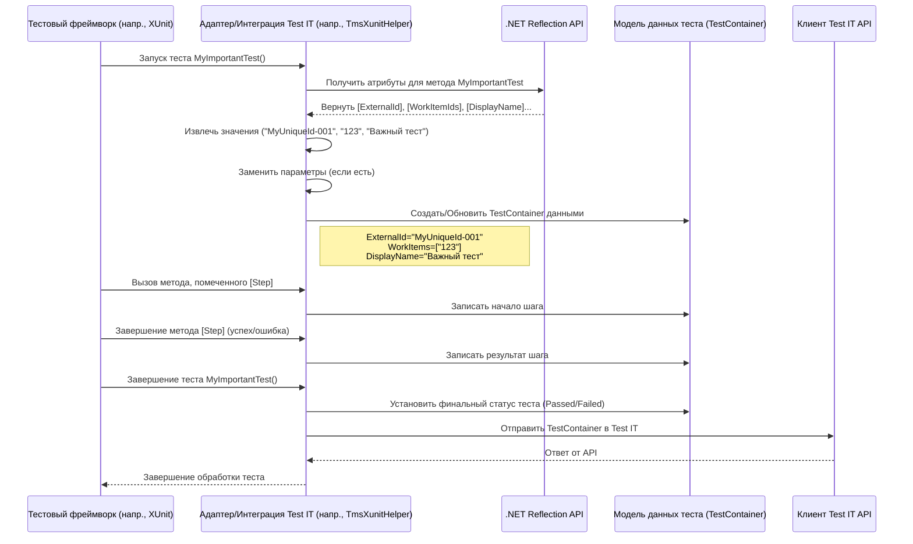

# Chapter 2: Атрибуты Метаданных Test IT


В [предыдущей главе](01_конфигурация_адаптера_.md) мы научились настраивать адаптер, чтобы он знал, *куда* отправлять результаты тестов. Но как адаптеру понять, *какой именно* тест-кейс в Test IT соответствует вашему автоматическому тесту? И как добавить к результатам дополнительную информацию, например, описание, ссылки на баги или ID связанных задач?

Именно для этого и нужны **Атрибуты Метаданных Test IT**. Представьте, что ваши тесты — это посылки, а Test IT — большой сортировочный центр. Атрибуты — это как раз те самые наклейки и ярлыки на посылках, которые помогают центру понять, что внутри, куда доставить и с чем эта посылка связана.

## Зачем нужны атрибуты?

Без атрибутов адаптер отправит результаты, но Test IT не сможет автоматически связать их с существующими тест-кейсами. Вы получите отчет о запуске, но без привязки к конкретным требованиям или ручным тестам. Это затрудняет анализ покрытия и отслеживание истории тестов.

**Основная задача атрибутов:** предоставить адаптеру дополнительную информацию (метаданные) о тесте, чтобы он мог правильно оформить результаты для Test IT.

**Главный сценарий использования:** Связать автоматический тест, написанный в коде (например, `UserCanLoginSuccessfully`), с определенным тест-кейсом в Test IT (например, с ID `TC-123`) и, возможно, добавить ссылку на связанный баг в трекере задач.

## Что такое атрибуты в C#?

Прежде чем погружаться в атрибуты Test IT, давайте кратко вспомним, что такое атрибуты в языке C#. Атрибуты — это специальные метки, которые можно добавлять к элементам кода (классам, методам, свойствам и т.д.). Они выглядят как `[ИмяАтрибута]` или `[ИмяАтрибута("параметр")]` и пишутся прямо перед тем элементом, к которому относятся.

Сами по себе атрибуты не меняют логику работы кода, но они предоставляют дополнительную информацию, которую другие части программы (например, наш адаптер Test IT) могут считывать во время выполнения с помощью механизма, называемого *рефлексией* (Reflection).

## Основные Атрибуты Метаданных Test IT

Адаптеры `adapters-dotnet` предоставляют набор атрибутов для передачи метаданных. Давайте рассмотрим самые важные из них.

*(Примечание: Точное пространство имен (namespace) для атрибутов может немного отличаться в зависимости от используемого адаптера - Core, MSTest/NUnit, XUnit, но названия и назначение атрибутов схожи).*

### `[ExternalId("уникальный_идентификатор")]`

Это **самый важный** атрибут для связи автотеста с тест-кейсом в Test IT. `ExternalId` — это уникальный идентификатор, который вы придумываете сами и указываете как в коде, так и в соответствующем поле тест-кейса в Test IT.

*   **Зачем он нужен?** Он создает надежную связь. Даже если вы переименуете метод теста в коде или измените его название в Test IT, связь сохранится благодаря этому ID. Test IT будет искать тест-кейс именно по этому `ExternalId`.
*   **Если тест-кейс не найден?** Если включена опция `AutomaticCreationTestCases` (см. [главу 1](01_конфигурация_адаптера_.md)), и тест-кейс с таким `ExternalId` не найден, адаптер может попытаться создать новый тест-кейс в Test IT.

```csharp
using Tms.Adapter.Attributes; // Используйте правильный namespace для вашего адаптера

[TestClass]
public class SampleTests
{
    // Этот тест будет связан с тест-кейсом в Test IT,
    // у которого External ID равен "MyUniqueId-001"
    [TestMethod]
    [ExternalId("MyUniqueId-001")]
    public void MyVeryImportantTest()
    {
        // ... логика теста ...
        Assert.IsTrue(true);
    }
}
```
*Что происходит:* Адаптер видит атрибут `[ExternalId("MyUniqueId-001")]` и при отправке результата в Test IT скажет: "Этот результат относится к тест-кейсу с External ID 'MyUniqueId-001'".

### `[WorkItemIds("ID_задачи_1", "ID_задачи_2", ...)]`

Этот атрибут позволяет связать ваш автотест с одной или несколькими *существующими* задачами (Work Items) в Test IT. Обычно это ID ручных тест-кейсов, которые автоматизирует данный тест.

```csharp
using Tms.Adapter.Attributes;
using Microsoft.VisualStudio.TestTools.UnitTesting;

[TestClass]
public class LoginTests
{
    // Этот автотест автоматизирует тест-кейсы с ID 123 и 456 в Test IT
    [TestMethod]
    [ExternalId("login-success")]
    [WorkItemIds("123", "456")] // Обратите внимание, ID передаются как строки
    public void SuccessfulLoginTest()
    {
        // ... логика теста входа ...
        Assert.IsTrue(true);
    }
}
```
*Что происходит:* Адаптер прочитает `[WorkItemIds("123", "456")]` и добавит ссылки на эти Work Items к результату теста, отправляемому в Test IT. Это позволит увидеть в Test IT, какие ручные тесты покрыты этим автотестом.

### `[DisplayName("Понятное Имя Теста")]`

Позволяет задать более читаемое имя для вашего теста, которое будет отображаться в отчетах Test IT. Если этот атрибут не указан, обычно используется имя метода теста.

```csharp
using Tms.Adapter.Attributes;
using Microsoft.VisualStudio.TestTools.UnitTesting;

[TestClass]
public class SearchTests
{
    [TestMethod]
    [ExternalId("search-product-by-name")]
    [DisplayName("Поиск товара по точному названию")] // Это имя будет в отчете
    public void SearchProduct_ExactMatch_ShouldReturnProduct()
    {
        // ... логика теста поиска ...
        Assert.IsTrue(true);
    }
}
```
*Что происходит:* В Test IT этот тест будет отображаться с именем "Поиск товара по точному названию", а не `SearchProduct_ExactMatch_ShouldReturnProduct`.

### `[Title("Техническое Название")]`

Очень похож на `DisplayName`, но часто используется для задания более технического или краткого заголовка. В некоторых случаях может использоваться для формирования имени файла или других внутренних нужд. Если есть и `DisplayName`, и `Title`, приоритет может зависеть от конфигурации или адаптера.

```csharp
using Tms.Adapter.Attributes;
// ...

    [TestMethod]
    [ExternalId("api-get-user-info")]
    [DisplayName("API: Получение информации о пользователе")]
    [Title("GetUser API Test")] // Технический заголовок
    public void GetUserInfoApiTest() { /* ... */ }
```

### `[Description("Подробное описание теста")]`

Добавляет описание к результату теста. Это полезно для пояснения цели теста или шагов, которые он выполняет.

```csharp
using Tms.Adapter.Attributes;
// ...

    [TestMethod]
    [ExternalId("checkout-flow")]
    [DisplayName("Проверка оформления заказа")]
    [Description("Тест проверяет полный цикл оформления заказа: добавление товара в корзину, ввод адреса доставки, выбор способа оплаты и подтверждение заказа.")]
    public void CompleteCheckoutProcess() { /* ... */ }
```
*Что происходит:* Текст из `Description` будет добавлен в детали результата теста в Test IT.

### `[Labels("метка1", "метка2", ...)]`

Позволяет добавить к тесту метки (теги). Метки в Test IT помогают группировать и фильтровать тесты по различным признакам (например, "smoke", "regression", "api", "ui").

```csharp
using Tms.Adapter.Attributes;
// ...

    [TestMethod]
    [ExternalId("smoke-test-main-page")]
    [DisplayName("Smoke-тест главной страницы")]
    [Labels("smoke", "ui", "critical")] // Набор меток
    public void MainPageSmokeTest() { /* ... */ }
```
*Что происходит:* К результату теста будут прикреплены метки "smoke", "ui" и "critical".

### `[Links(url: "...", title: "...", description: "...", type: LinkType...)]`

Позволяет прикрепить к результату теста одну или несколько ссылок на внешние ресурсы. Это могут быть ссылки на:
*   Баги в баг-трекере (`LinkType.BugTracker`)
*   Требования (`LinkType.Requirement`)
*   Репозиторий с кодом (`LinkType.Repository`)
*   Любую другую связанную информацию (`LinkType.Related`)
*   Заблокировавшую задачу (`LinkType.BlockedBy`)
*   Просто ссылку без типа (`LinkType.Defect` - устаревший, `LinkType.Issue` - устаревший)

Можно указать URL, заголовок ссылки, описание и тип. Есть сокращенный вариант только с URL.

```csharp
using Tms.Adapter.Attributes;
using Tms.Adapter.Core.Models; // Для LinkType
using Microsoft.VisualStudio.TestTools.UnitTesting;

[TestClass]
public class BugReproductionTests
{
    [TestMethod]
    [ExternalId("repro-bug-555")]
    [DisplayName("Воспроизведение бага #555")]
    [Links(
        url: "https://jira.example.com/browse/BUG-555",
        title: "Ссылка на баг в Jira",
        description: "Основные детали бага",
        type: LinkType.BugTracker
    )]
    [Links(
        url: "https://requirements.example.com/req/REQ-101",
        title: "Связанное требование",
        type: LinkType.Requirement
    )]
    [Links(url: "https://service-docs.example.com/api/v2")] // Ссылка без доп. информации
    public void ReproduceBug555()
    {
        // ... тест, воспроизводящий баг ...
        // Assert.Fail("Баг воспроизведен"); // Пример, если тест должен падать
    }
}
```
*Что происходит:* К результату теста будут прикреплены три ссылки с указанными параметрами.

### `[Step]` (в адаптерах для MSTest/NUnit/XUnit)

Этот специальный атрибут используется не для метаданных самого теста, а для разметки *шагов* внутри теста. Если вы пометите какой-либо метод вашего тестового класса атрибутом `[Step]`, то вызов этого метода во время выполнения теста будет зафиксирован адаптером как отдельный шаг. Это делает отчеты в Test IT более детальными, показывая, какие именно действия выполнялись внутри теста и на каком шаге произошла ошибка.

```csharp
using Tms.Adapter.Attributes; // Или Tms.Adapter.XUnit.Attributes
using Microsoft.VisualStudio.TestTools.UnitTesting;

[TestClass]
public class RegistrationTests
{
    [TestMethod]
    [ExternalId("register-new-user")]
    [DisplayName("Регистрация нового пользователя")]
    public void RegisterNewUser()
    {
        OpenRegistrationForm(); // Шаг 1
        FillUserData("testuser", "password123", "test@example.com"); // Шаг 2
        SubmitForm(); // Шаг 3
        VerifyRegistrationSuccess(); // Шаг 4
    }

    // Методы, помеченные [Step], будут отображаться как шаги в Test IT
    [Step]
    // [Title("Открыть форму регистрации")] // Можно добавить Title и Description к шагу
    // [Description("Переходит на страницу /register")]
    private void OpenRegistrationForm()
    {
        Console.WriteLine("Открываю форму регистрации...");
        // ... код для Selenium/Playwright ...
    }

    [Step]
    private void FillUserData(string username, string password, string email)
    {
        Console.WriteLine($"Заполняю данные: {username}, {email}");
        // ... код для заполнения полей ...
    }

    [Step]
    private void SubmitForm()
    {
        Console.WriteLine("Нажимаю кнопку 'Зарегистрироваться'...");
        // ... код клика по кнопке ...
    }

    [Step]
    private void VerifyRegistrationSuccess()
    {
        Console.WriteLine("Проверяю сообщение об успешной регистрации...");
        // ... код проверки + Assert ...
        Assert.IsTrue(true);
    }
}
```
*Что происходит:* Когда тест `RegisterNewUser` выполняется, адаптер перехватывает вызовы методов `OpenRegistrationForm`, `FillUserData`, `SubmitForm` и `VerifyRegistrationSuccess`. Он записывает их как шаги и отправляет эту информацию вместе с результатом теста в Test IT. Если, например, `VerifyRegistrationSuccess` упадет, в отчете будет видно, что предыдущие шаги прошли успешно, а ошибка произошла именно на шаге верификации.

## Как это работает "под капотом"?

Магия происходит благодаря механизму **рефлексии** (.NET Reflection) и, в случае с `[Step]`, иногда **аспектно-ориентированному программированию** (AOP).

1.  **Запуск теста:** Ваш тестовый фреймворк (MSTest, NUnit, XUnit) запускает тест-метод.
2.  **Перехват Адаптером:** Интеграция адаптера Test IT (например, через `EventListener` для NUnit/MSTest или `TestMessageSink` для XUnit) получает уведомление о начале выполнения теста.
3.  **Чтение Атрибутов:** Адаптер использует рефлексию, чтобы "осмотреть" выполняемый метод теста (`MethodInfo`) и найти на нем все атрибуты, унаследованные от `ITmsAttribute` (или специфичные для Test IT атрибуты).
4.  **Извлечение Данных:** Адаптер считывает значения, переданные в конструкторы атрибутов (например, `"MyUniqueId-001"` из `[ExternalId("MyUniqueId-001")]` или список ID из `[WorkItemIds(...)]`).
5.  **Подстановка Параметров (если есть):** Если тест параметризованный, и атрибут содержит плейсхолдеры (например, `[DisplayName("Тест для пользователя {userId}")]`), адаптер подставляет актуальные значения параметров теста (`Replacer.ReplaceParameters`).
6.  **Формирование Модели Данных:** Собранные метаданные (External ID, Display Name, Work Item IDs, Links, Labels, Description) упаковываются в объект, представляющий результат теста ([Модели Данных Тестов](06_модели_данных_тестов_.md)).
7.  **Обработка Шагов (`[Step]`):**
    *   Для `[Step]` часто используется AOP (например, с помощью `AspectInjector` в XUnit-адаптере или `MethodBoundaryAspect.Fody` в MSTest/NUnit-адаптере). Это означает, что код адаптера автоматически "внедряется" до и после выполнения метода, помеченного `[Step]`.
    *   Перед вызовом метода (`OnEntry`) адаптер записывает начало шага (с его именем, параметрами).
    *   После выполнения метода (`OnExit` или `OnException`) адаптер записывает результат шага (успех, падение, длительность).
    *   Эта информация о шагах добавляется к общей модели данных теста.
8.  **Отправка в Test IT:** Готовый объект с результатами и всеми метаданными отправляется в Test IT через [Клиент TMS (Test IT)](05_клиент_tms__test_it_.md), используя настройки, полученные из [конфигурации](01_конфигурация_адаптера_.md).

**Упрощенная диаграмма:**



**Где посмотреть код:**

*   Определения атрибутов: `Tms.Adapter.Core/Attributes/` (например, `ExternalIdAttribute.cs`, `LinksAttribute.cs`) или аналогичные папки в специфичных адаптерах (`Tms.Adapter`, `Tms.Adapter.XUnit`).
*   Чтение атрибутов в XUnit: `Tms.Adapter.XUnit/TmsXunitHelper.cs` (метод `UpdateTestDataFromAttributes`).
*   Чтение атрибутов в TmsRunner (для MSTest/NUnit): `TmsRunner/Utils/LogParser.cs` (метод `GetAutoTest`).
*   Обработка шагов в XUnit: `Tms.Adapter.XUnit/Aspects/StepAspect.cs`.
*   Обработка шагов в MSTest/NUnit: `Tms.Adapter/Attributes/StepAttribute.cs`.
*   Обработка тегов SpecFlow (альтернатива атрибутам): `Tms.Adapter.SpecFlowPlugin/TmsTagParser.cs`.

## Заключение

Атрибуты метаданных — это мощный инструмент для обогащения ваших автоматических тестов информацией, необходимой для полной интеграции с Test IT. Используя `[ExternalId]`, `[WorkItemIds]`, `[DisplayName]`, `[Links]`, `[Labels]`, `[Description]` и `[Step]`, вы можете:

*   Надежно связывать автотесты с тест-кейсами в Test IT.
*   Указывать, какие ручные тесты автоматизированы.
*   Делать отчеты более читаемыми.
*   Добавлять контекст в виде ссылок и описаний.
*   Группировать тесты с помощью меток.
*   Получать детализированные отчеты с шагами выполнения теста.

Освоив использование этих атрибутов, вы значительно повысите ценность ваших автоматизированных тестов и упростите анализ результатов в Test IT.

В следующей главе мы рассмотрим, как конкретно происходит интеграция адаптера с одним из популярных фреймворков на примере XUnit: [Интеграция с Фреймворком (на примере XUnit)](03_интеграция_с_фреймворком__на_примере_xunit__.md).

---

Generated by [AI Codebase Knowledge Builder](https://github.com/The-Pocket/Tutorial-Codebase-Knowledge)