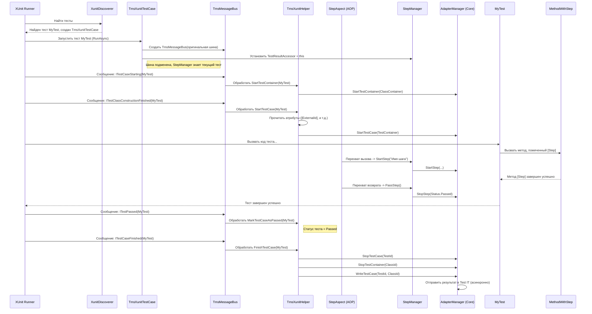

# Chapter 3: Интеграция с Фреймворком (на примере XUnit)


В [предыдущей главе](02_аттрибуты_метаданных_test_it_.md) мы узнали, как с помощью атрибутов добавить нашим тестам "ярлыки" и "наклейки", связывающие их с Test IT и обогащающие отчеты. Теперь давайте приоткроем завесу тайны и посмотрим, как адаптер *встраивается* в ваш тестовый фреймворк, чтобы собрать всю эту информацию и отследить жизненный цикл тестов.

Представьте, что ваш тестовый фреймворк (например, XUnit) — это сложный механизм, как двигатель автомобиля. Чтобы узнать его состояние (скорость, обороты, температуру), нужны датчики и приборная панель. Адаптер Test IT как раз и выступает в роли этих "датчиков", подключаясь к "двигателю" XUnit в нужных местах.

**Зачем это нужно?**

Тестовый фреймворк управляет всем процессом: он находит ваши тесты, запускает их, фиксирует результаты (успех, падение, пропуск) и выполняет методы подготовки/очистки (`Before`/`After`). Адаптеру нужно как-то *узнать* обо всех этих событиях, чтобы вовремя:

1.  Начать отслеживание теста.
2.  Зафиксировать его начало, шаги, фикстуры (`Before`/`After`).
3.  Записать результат (успех, падение с ошибкой, пропуск).
4.  Отправить всю собранную информацию в Test IT.

Без этой интеграции адаптер был бы слеп и глух к тому, что происходит во время тестового запуска.

В этой главе мы разберем, как адаптер `adapters-dotnet` интегрируется с одним из популярных фреймворков — **XUnit**. Принципы интеграции с другими фреймворками (MSTest, NUnit, SpecFlow) похожи, но используют свои специфичные механизмы.

## Ключевые Точки Интеграции с XUnit

XUnit предоставляет несколько механизмов расширения, которые адаптер использует для своей работы:

1.  **Обнаружение Тестов (`IXunitTestCaseDiscoverer`):** XUnit использует "обнаружители" (discoverers), чтобы найти методы, помеченные атрибутами `[Fact]` или `[Theory]`. Адаптер подменяет стандартные обнаружители своими, чтобы создать *специальный* объект тест-кейса.
2.  **Пользовательский Тест-Кейс (`TmsXunitTestCase`):** Вместо стандартного `XunitTestCase`, адаптер создает свой `TmsXunitTestCase`. Этот объект "помнит" информацию, нужную адаптеру (например, ID контейнеров для Test IT), и немного изменяет процесс запуска теста.
3.  **Шина Сообщений (`IMessageBus`):** XUnit использует шину сообщений для оповещения о различных событиях во время выполнения тестов (старт тест-кейса, тест упал, тест прошел, и т.д.). Адаптер "обертывает" эту шину своей реализацией (`TmsMessageBus`), чтобы перехватывать нужные сообщения.
4.  **Обработчик Событий (`TmsXunitHelper`):** Этот класс получает перехваченные сообщения от `TmsMessageBus` и преобразует их в вызовы [Менеджера Адаптера](04_менеджер_адаптера__core__.md) (`AdapterManager`), который уже управляет состоянием теста и готовит данные для отправки.
5.  **Аспектно-Ориентированное Программирование (AOP) для Шагов (`StepAspect`):** Чтобы автоматически перехватывать вызовы методов, помеченных как `[Step]`, `[Before]` или `[After]`, адаптер использует технику AOP (с помощью библиотеки AspectInjector). Это как "наблюдатель", который до и после выполнения этих методов сообщает адаптеру о начале и завершении шага или фикстуры.

Давайте рассмотрим эти части подробнее.

### 1. Обнаружение Тестов: Подмена Стандартного Поведения

Когда XUnit сканирует ваши сборки на наличие тестов, он ищет атрибуты `[Fact]` и `[Theory]`. Обычно эти атрибуты указывают на стандартные "обнаружители" (`FactDiscoverer`, `TheoryDiscoverer`). Адаптер Test IT предоставляет свои атрибуты (или использует специальную конфигурацию), чтобы XUnit использовал его обнаружители: `XunitDiscoverer` и `XunitTheoryDiscoverer`.

```csharp
// Упрощенный пример, как это могло бы выглядеть при использовании
// (на практике это может быть скрыто в конфигурации пакета)
using Tms.Adapter.XUnit.Discover; // Примерное пространство имен
using Xunit;

public class MyXunitTests
{
    // Указываем XUnit использовать наш обнаружитель
    [Fact]
    [XunitTestCaseDiscoverer(typeof(XunitDiscoverer), "Tms.Adapter.XUnit")]
    public void MyFirstTest() { /* ... */ }

    [Theory]
    [InlineData(1)]
    [InlineData(2)]
    // Указываем обнаружитель для параметризованных тестов
    [XunitTestCaseDiscoverer(typeof(XunitTheoryDiscoverer), "Tms.Adapter.XUnit")]
    public void MyParametrizedTest(int value) { /* ... */ }
}

```
*Что здесь происходит:* Мы (или чаще всего, NuGet-пакет адаптера) говорим XUnit: "Когда найдешь этот `[Fact]` или `[Theory]`, используй не стандартный обнаружитель, а вот этот: `XunitDiscoverer` (или `XunitTheoryDiscoverer`)".

Эти обнаружители (`XunitDiscoverer`, `XunitTheoryDiscoverer`) делают почти то же самое, что и стандартные, но с одним важным отличием: они создают не обычный `XunitTestCase`, а наш кастомный `TmsXunitTestCase`.

```csharp
// File: Tms.Adapter.XUnit/XunitDiscover.cs (Упрощенно)
using Xunit.Abstractions;
using Xunit.Sdk;

namespace Tms.Adapter.XUnit;

public class XunitDiscover : IXunitTestCaseDiscoverer
{
    // ... (Конструктор) ...

    public IEnumerable<IXunitTestCase> Discover(
        ITestFrameworkDiscoveryOptions discoveryOptions,
        ITestMethod testMethod,
        IAttributeInfo factAttribute)
    {
        // Вместо new XunitTestCase(...) создаем наш TmsXunitTestCase
        var tmsTestCase = new TmsXunitTestCase(
            _diagnosticMessageSink,
            discoveryOptions.MethodDisplayOrDefault(),
            TestMethodDisplayOptions.None,
            testMethod);

        return new[] { tmsTestCase }; // Возвращаем массив с одним нашим тест-кейсом
    }
}
```
*Ключевое:* Создается `TmsXunitTestCase` вместо стандартного.

### 2. Пользовательский Тест-Кейс: `TmsXunitTestCase`

Этот класс наследуется от стандартного `XunitTestCase`, но добавляет несколько важных вещей:

*   **Хранение Контекста:** Он содержит поля `ClassContainer` и `TestResult` (это [Модели Данных Тестов](06_модели_данных_тестов_.md)), чтобы хранить информацию о текущем классе и тесте для Test IT.
*   **Переопределение Запуска (`RunAsync`):** Самое главное – он переопределяет метод `RunAsync`, который XUnit вызывает для запуска теста. Внутри этого переопределенного метода происходит магия:
    *   Он получает доступ к `IMessageBus` (шине сообщений).
    *   Он "оборачивает" оригинальную шину в нашу `TmsMessageBus`.
    *   Он устанавливает `StepManager.TestResultAccessor = this;`, делая текущий `TmsXunitTestCase` (и его `ClassContainer`, `TestResult`) доступным для `StepAspect`, который будет отслеживать шаги.
    *   Он передает *обернутую* шину дальше для фактического выполнения теста.

```csharp
// File: Tms.Adapter.XUnit/TmsXunitTestCase.cs (Упрощенно)
using Tms.Adapter.Core.Models;
using Xunit.Abstractions;
using Xunit.Sdk;

namespace Tms.Adapter.XUnit;

public class TmsXunitTestCase : XunitTestCase, ITmsAccessor // ITmsAccessor для хранения данных
{
    // Свойства для хранения информации Test IT
    public ClassContainer ClassContainer { get; set; }
    public TestContainer TestResult { get; set; }

    // ... (Конструкторы) ...

    public override async Task<RunSummary> RunAsync(
        IMessageSink diagnosticMessageSink,
        IMessageBus messageBus, // Оригинальная шина сообщений
        object[] constructorArguments,
        ExceptionAggregator aggregator,
        CancellationTokenSource cancellationTokenSource)
    {
        // 1. Делаем текущий тест-кейс доступным для StepManager/StepAspect
        StepManager.TestResultAccessor = this;

        // 2. Оборачиваем оригинальную шину в нашу TmsMessageBus
        messageBus = new TmsMessageBus(messageBus);

        // 3. Запускаем тест с нашей обернутой шиной
        var summary = await base.RunAsync(diagnosticMessageSink, messageBus,
                                        constructorArguments, aggregator, cancellationTokenSource);
        return summary;
    }
}
```
*Ключевое:* Перед запуском теста подменяется шина сообщений на `TmsMessageBus`, чтобы перехватывать события.

### 3. Шина Сообщений: `TmsMessageBus`

Это простой "обертчик" (wrapper) вокруг стандартной шины сообщений XUnit. Его задача — перехватывать определенные типы сообщений, проходящие через него, и передавать их нашему `TmsXunitHelper` для обработки, прежде чем отправить дальше по цепочке.

```csharp
// File: Tms.Adapter.XUnit/TmsMessageBus.cs (Упрощенно)
using Xunit.Abstractions;
using Xunit.Sdk;

namespace Tms.Adapter.XUnit;

public class TmsMessageBus : IMessageBus
{
    private readonly IMessageBus _inner; // Ссылка на оригинальную шину

    public TmsMessageBus(IMessageBus inner) { _inner = inner; }

    public bool QueueMessage(IMessageSinkMessage message) // Вызывается XUnit для каждого события
    {
        // Проверяем тип сообщения
        switch (message)
        {
            // Тест-кейс начинает выполняться (еще до создания экземпляра класса)
            case ITestCaseStarting testCaseStarting:
                TmsXunitHelper.StartTestContainer(testCaseStarting);
                break;
            // Экземпляр тестового класса создан, реальный тест вот-вот начнется
            case ITestClassConstructionFinished testClassConstructionFinished:
                TmsXunitHelper.StartTestCase(testClassConstructionFinished);
                break;
            // Тест упал
            case ITestFailed testFailed:
                TmsXunitHelper.MarkTestCaseAsFailed(testFailed);
                break;
            // Тест успешно завершился
            case ITestPassed testPassed:
                TmsXunitHelper.MarkTestCaseAsPassed(testPassed);
                break;
            // Тест-кейс полностью завершился (успешно, упал или пропущен)
            case ITestCaseFinished testCaseFinished:
                // Обработка пропущенных тестов (XUnit сообщает о них только в конце)
                if (testCaseFinished.TestCase.SkipReason != null)
                {
                    TmsXunitHelper.StartTestCase(testCaseFinished); // Нужно начать, т.к. не было ConstructionFinished
                    TmsXunitHelper.MarkTestCaseAsSkipped(testCaseFinished);
                }
                TmsXunitHelper.FinishTestCase(testCaseFinished); // Финализация
                break;
        }

        // Передаем сообщение дальше по стандартной цепочке XUnit
        return _inner.QueueMessage(message);
    }

    public void Dispose() => _inner.Dispose();
}
```
*Ключевое:* Перехватываем события `ITestCaseStarting`, `ITestClassConstructionFinished`, `ITestFailed`, `ITestPassed`, `ITestCaseFinished` и вызываем методы `TmsXunitHelper`.

### 4. Обработчик Событий: `TmsXunitHelper`

Это статический класс, который содержит логику реакции на события XUnit. Он берет информацию из сообщений XUnit (например, имя теста, сообщение об ошибке, стек вызовов) и использует [Менеджер Адаптера](04_менеджер_адаптера__core__.md) (`AdapterManager.Instance`) для управления жизненным циклом теста в контексте Test IT.

```csharp
// File: Tms.Adapter.XUnit/TmsXunitHelper.cs (Упрощенно)
using Tms.Adapter.Core.Models;
using Tms.Adapter.Core.Service; // Используем AdapterManager
using Tms.Adapter.Core.Attributes; // Используем атрибуты Test IT
using Xunit.Abstractions;
using Xunit.Sdk;

namespace Tms.Adapter.XUnit;

public static class TmsXunitHelper
{
    // Вызывается при ITestCaseStarting
    public static void StartTestContainer(ITestCaseStarting testCaseStarting)
    {
        // Получаем наш TmsXunitTestCase (через интерфейс ITmsAccessor)
        if (testCaseStarting.TestCase is ITmsAccessor testResultAccessor)
        {
            // Создаем ClassContainer
            testResultAccessor.ClassContainer = new ClassContainer { Id = Hash.NewId() };
            // Сообщаем AdapterManager о начале контейнера класса
            AdapterManager.Instance.StartTestContainer(testResultAccessor.ClassContainer);
        }
    }

    // Вызывается при ITestClassConstructionFinished или для пропущенных тестов
    public static void StartTestCase(ITestCaseMessage testCaseMessage)
    {
        if (testCaseMessage.TestCase is ITmsAccessor testResultAccessor)
        {
            // Создаем TestContainer (данные самого теста)
            testResultAccessor.TestResult = new TestContainer { Id = Hash.NewId() /*...*/ };
            // Читаем атрибуты [ExternalId], [DisplayName] и т.д. с метода теста
            UpdateTestDataFromAttributes(testResultAccessor.TestResult, testCaseMessage.TestCase);
            // Сообщаем AdapterManager о начале самого теста
            AdapterManager.Instance.StartTestCase(testResultAccessor.ClassContainer.Id, testResultAccessor.TestResult);
        }
    }

    // Вызывается при ITestFailed
    public static void MarkTestCaseAsFailed(ITestFailed testFailed)
    {
        if (testFailed.TestCase is ITmsAccessor testResultAccessor)
        {
            // Записываем сообщение и стек ошибки
            testResultAccessor.TestResult.Message = string.Join('\n', testFailed.Messages);
            testResultAccessor.TestResult.Trace = string.Join('\n', testFailed.StackTraces);
            testResultAccessor.TestResult.Status = Status.Failed;
            // AdapterManager обновит статус, когда тест завершится
        }
    }

    // Вызывается при ITestPassed
    public static void MarkTestCaseAsPassed(ITestPassed testPassed)
    {
        if (testPassed.TestCase is ITmsAccessor testResultAccessor)
        {
            testResultAccessor.TestResult.Status = Status.Passed;
        }
    }

    // Вызывается при ITestPassed
    public static void MarkTestCaseAsSkipped(ITestCaseMessage testCaseMessage)
    {
        if (testCaseMessage.TestCase is ITmsAccessor testResultAccessor)
        {
            testResultAccessor.TestResult.Message = testCaseMessage.TestCase.SkipReason;
            testResultAccessor.TestResult.Status = Status.Skipped;
        }
    }

     // Вызывается при ITestCaseFinished
    public static void FinishTestCase(ITestCaseMessage testCaseMessage)
    {
        if (testCaseMessage.TestCase is ITmsAccessor testResultAccessor)
        {
            var testResult = testResultAccessor.TestResult;
            var classContainer = testResultAccessor.ClassContainer;

            // Сообщаем AdapterManager о завершении теста (он использует статус, который мы установили ранее)
            AdapterManager.Instance.StopTestCase(testResult.Id);
            // Сообщаем AdapterManager о завершении контейнера класса
            AdapterManager.Instance.StopTestContainer(classContainer.Id);
            // Говорим AdapterManager записать результаты этого теста
            AdapterManager.Instance.WriteTestCase(testResult.Id, classContainer.Id);
        }
    }

    // Вспомогательный метод для чтения атрибутов Test IT
    private static void UpdateTestDataFromAttributes(TestContainer testResult, ITestCase testCase)
    {
        // Используем рефлексию XUnit для получения атрибутов метода
        var methodAttributes = testCase.TestMethod.Method.GetCustomAttributes(typeof(ITmsAttribute));
        foreach (var attributeInfo in methodAttributes)
        {
            // ... логика извлечения данных из [ExternalId], [DisplayName] и т.д. ...
            // (Как в Главе 2, но через API XUnit)
            // Например:
            // if (((IReflectionAttributeInfo)attributeInfo).Attribute is ExternalIdAttribute externalId)
            // {
            //     testResult.ExternalId = externalId.Value;
            // }
        }
        // ... установка ExternalId/DisplayName по умолчанию, если атрибуты не найдены ...
    }
    // ... другие вспомогательные методы ...
}
```
*Ключевое:* Преобразует события XUnit в команды для `AdapterManager`, управляет созданием `ClassContainer` и `TestContainer`, читает атрибуты Test IT.

### 5. Автоматическое Отслеживание Шагов: `StepAspect`

Как мы видели в [Главе 2](02_аттрибуты_метаданных_test_it_.md), атрибут `[Step]` позволяет размечать шаги внутри теста. Но как адаптер узнает, когда эти методы вызываются?

В XUnit-адаптере для этого используется **Аспектно-Ориентированное Программирование (AOP)** с помощью библиотеки `AspectInjector`. Это похоже на "волшебство", которое позволяет добавить дополнительную логику *вокруг* вызова метода без изменения самого метода.

*   `StepAspect` — это специальный класс-"аспект", который объявляет, что его логика должна выполняться *вокруг* (`[Advice(Kind.Around)]`) методов, помеченных атрибутами `[Step]`, `[Before]` или `[After]`.
*   Когда XUnit (или ваш код) вызывает метод, помеченный, например, `[Step]`, AspectInjector перехватывает этот вызов.
*   Он вызывает метод `Around` в `StepAspect`.
*   Метод `Around` делает следующее:
    1.  Вызывает `StepManager.StartStep(...)` (или `StartBeforeFixture`/`StartAfterFixture` для `[Before]` / `[After]`). `StepManager` получает доступ к текущему `TmsXunitTestCase` через `TestResultAccessor`, который мы установили ранее.
    2.  Выполняет *оригинальный* код вашего метода (`target(args)`).
    3.  Если метод завершился успешно, вызывает `StepManager.PassStep()` (или `StopFixture(Status.Passed)`).
    4.  Если метод выбросил исключение, вызывает `StepManager.FailStep()` (или `StopFixture(Status.Failed)`).

```csharp
// File: Tms.Adapter.XUnit/Aspects/StepAspect.cs (Очень упрощенно)
using AspectInjector.Broker;
using Tms.Adapter.Core.Attributes; // Атрибуты Step, Before, After
using Tms.Adapter.Core.Models;
using System.Reflection;

namespace Tms.Adapter.XUnit.Aspects;

[Aspect(Scope.Global)] // Применяется ко всему проекту
public class StepAspect
{
    [Advice(Kind.Around)] // Выполняется "вокруг" целевого метода
    public object Around(
        [Argument(Source.Name)] string name, // Имя метода
        [Argument(Source.Arguments)] object[] args, // Аргументы метода
        [Argument(Source.Target)] Func<object[], object> target, // Сам целевой метод
        [Argument(Source.Metadata)] MethodBase metadata // Информация о методе (для атрибутов)
        /* ...другие аргументы... */
        )
    {
        object executionResult;
        bool isStep = metadata.GetCustomAttribute<StepAttribute>() != null;
        bool isBefore = metadata.GetCustomAttribute<BeforeAttribute>() != null;
        bool isAfter = metadata.GetCustomAttribute<AfterAttribute>() != null;

        // Извлекаем параметры и имя для отчета (как в Главе 2)
        var stepName = metadata.GetCustomAttribute<TitleAttribute>()?.Value ?? name;
        // ... логика для извлечения параметров и подстановки в stepName/description ...

        try
        {
            // 1. Сообщаем о начале шага/фикстуры
            if (isStep) StepManager.StartStep(stepName /*, параметры, описание */);
            if (isBefore) StepManager.StartBeforeFixture(stepName);
            if (isAfter) StepManager.StartAfterFixture(stepName);

            // 2. Выполняем оригинальный метод
            executionResult = target(args);

            // 3. Сообщаем об успешном завершении
            if (isStep) StepManager.PassStep();
            if (isBefore || isAfter) StepManager.StopFixture(r => r.Status = Status.Passed);
        }
        catch (Exception)
        {
            // 4. Сообщаем о падении
            if (isStep) StepManager.FailStep();
            if (isBefore || isAfter) StepManager.StopFixture(r => r.Status = Status.Failed);
            throw; // Перебрасываем исключение дальше
        }

        return executionResult; // Возвращаем результат оригинального метода
    }
}
```
*Ключевое:* AOP автоматически вызывает `StepManager` до и после выполнения методов с атрибутами `[Step]`, `[Before]`, `[After]`, избавляя вас от необходимости делать это вручную.

## Как Все Это Работает Вместе: Пошаговый Обзор

Давайте проследим путь одного XUnit-теста с момента запуска до отправки результатов:



1.  **Обнаружение:** XUnit находит тест `MyTest` с помощью `XunitDiscoverer` и создает `TmsXunitTestCase`.
2.  **Запуск:** XUnit вызывает `RunAsync` у `TmsXunitTestCase`.
3.  **Подготовка:** `RunAsync` создает `TmsMessageBus`, обернув стандартную шину, и сообщает `StepManager` о текущем тест-кейсе.
4.  **Старт Контейнера:** XUnit отправляет сообщение `ITestCaseStarting`. `TmsMessageBus` перехватывает его и вызывает `TmsXunitHelper.StartTestContainer`, который создает `ClassContainer` и вызывает `AdapterManager.StartTestContainer`.
5.  **Старт Теста:** XUnit создает экземпляр тестового класса и отправляет `ITestClassConstructionFinished`. `TmsMessageBus` -> `TmsXunitHelper.StartTestCase`. `TmsXunitHelper` создает `TestContainer`, читает атрибуты (`[ExternalId]`, `[DisplayName]`, ...) и вызывает `AdapterManager.StartTestCase`.
6.  **Выполнение Шага:** Код теста вызывает метод, помеченный `[Step]`. `StepAspect` перехватывает вызов, вызывает `StepManager.StartStep` (который обращается к `AdapterManager`), выполняет метод, затем вызывает `StepManager.PassStep` (-> `AdapterManager`).
7.  **Завершение Теста (Успех):** Тест успешно завершается. XUnit отправляет `ITestPassed`. `TmsMessageBus` -> `TmsXunitHelper.MarkTestCaseAsPassed`, который просто запоминает статус `Passed`.
8.  **Финализация:** XUnit отправляет `ITestCaseFinished`. `TmsMessageBus` -> `TmsXunitHelper.FinishTestCase`. `TmsXunitHelper` вызывает `AdapterManager.StopTestCase`, `AdapterManager.StopTestContainer` и, наконец, `AdapterManager.WriteTestCase`.
9.  **Отправка:** `AdapterManager` добавляет готовый результат в очередь на отправку в Test IT.

Если бы тест упал, на шаге 7 было бы сообщение `ITestFailed`, `TmsXunitHelper` запомнил бы статус `Failed` и добавил сообщение об ошибке. Если бы упал метод `[Before]`, `StepAspect` вызвал бы `StopFixture(Failed)`, и `TmsXunitHelper` мог бы также пометить основной тест как упавший.

## Заключение

Интеграция с тестовым фреймворком — это сердце адаптера. На примере XUnit мы увидели, как `adapters-dotnet` использует специфичные для фреймворка механизмы (обнаружение тестов, шина сообщений) и современные техники (AOP) для того, чтобы:

*   Создавать свои объекты тестов (`TmsXunitTestCase`).
*   Перехватывать события жизненного цикла теста (старт, успех, падение, финиш).
*   Автоматически отслеживать шаги и фикстуры (`[Step]`, `[Before]`, `[After]`).
*   Собирать метаданные из атрибутов.
*   Оркестрировать весь процесс через `TmsXunitHelper`, который взаимодействует с ядром адаптера.

Понимание этих механизмов помогает лучше диагностировать проблемы и видеть, как информация из вашего кода попадает в Test IT. Хотя детали реализации для MSTest, NUnit или SpecFlow будут отличаться, общая идея остается той же: найти точки расширения фреймворка и подключиться к ним для сбора и отправки данных.

В следующей главе мы погрузимся глубже в ядро адаптера и рассмотрим его главный управляющий компонент: [Менеджер Адаптера (Core)](04_менеджер_адаптера__core__.md).

---

Generated by [AI Codebase Knowledge Builder](https://github.com/The-Pocket/Tutorial-Codebase-Knowledge)