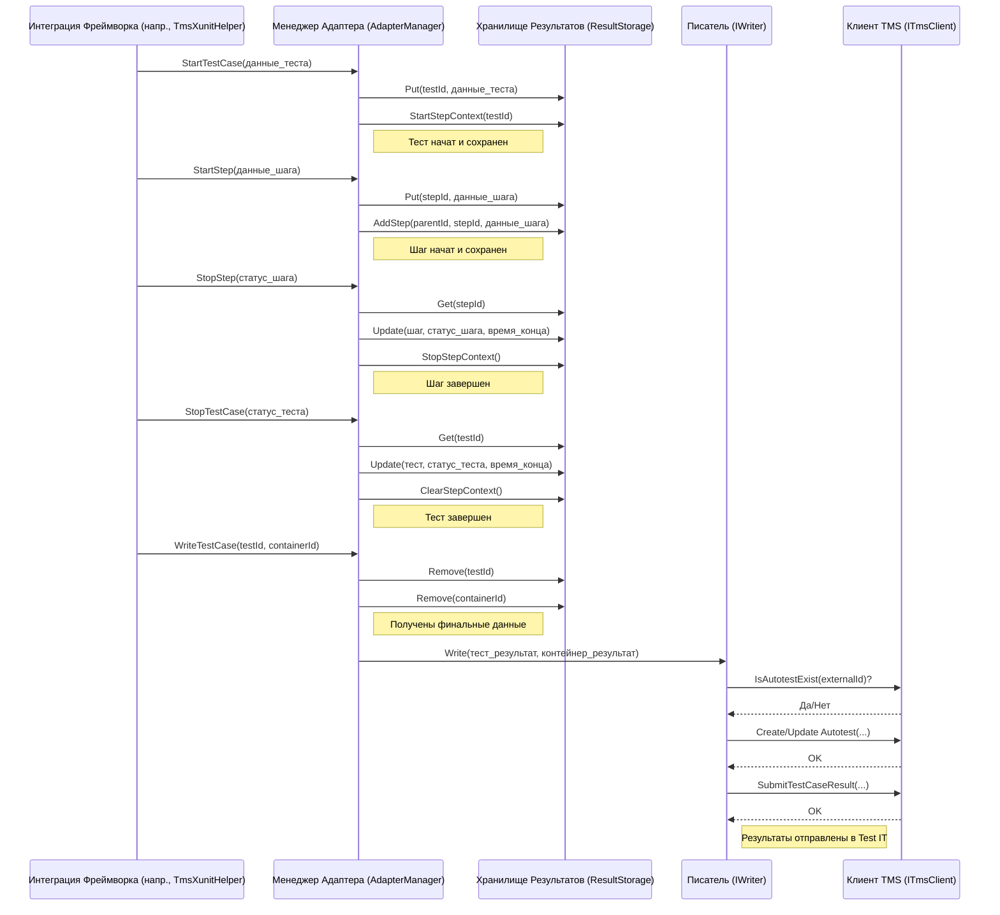

# Chapter 4: Менеджер Адаптера (Core)


В [предыдущей главе](03_интеграция_с_фреймворком__на_примере_xunit__.md) мы подробно рассмотрели, как наш адаптер встраивается в тестовый фреймворк XUnit, словно датчики в двигатель, чтобы перехватывать события и собирать информацию о тестах. Мы видели, как `TmsXunitHelper` реагирует на сигналы от XUnit. Но кто же является главным дирижером этого оркестра? Куда `TmsXunitHelper` передает управление?

Встречайте **Менеджер Адаптера (`AdapterManager`)** — центральный мозг и сердце ядра адаптера (`Tms.Adapter.Core`).

## Зачем нужен Менеджер Адаптера?

Представьте себе съемочную площадку фильма. У вас есть актеры (тесты), декорации (фикстуры `Before`/`After`), отдельные дубли (шаги). Кто всем этим управляет? Режиссер! Он кричит "Камера, мотор!" (начало теста), следит за ходом съемки сцены (выполнение шагов), говорит "Снято!" (конец теста) и передает отснятый материал монтажерам (отправка результатов).

**Менеджер Адаптера (`AdapterManager`)** — это и есть тот самый "режиссер" для ваших тестов. Его главная задача — управлять жизненным циклом всего, что происходит во время тестового запуска:

1.  **Знать, когда начинается "съемка" класса тестов.**
2.  **Знать, когда начинается и заканчивается каждая фикстура** (`Before`/`After`).
3.  **Знать, когда начинается каждый отдельный тест.**
4.  **Знать, когда начинается и заканчивается каждый шаг** внутри теста или фикстуры.
5.  **Обновлять состояние** этих элементов (например, помечать тест как "упавший" или шаг как "пройденный").
6.  **Знать, когда тест или фикстура полностью завершены.**
7.  **Организовать хранение промежуточных данных** о ходе выполнения.
8.  **Инициировать отправку финальных результатов** в Test IT.

Без этого центрального координатора интеграция с фреймворком (как в XUnit) не смогла бы правильно собрать и структурировать информацию для Test IT. Каждый тест, шаг и фикстура были бы разрозненными кусочками, а не единой картиной.

## Ключевые Компоненты и Обязанности

`AdapterManager` не работает в одиночку. У него есть два главных помощника:

1.  **Хранилище Результатов (`ResultStorage`):** Представьте, что это оперативная память режиссера или его записная книжка. Пока идет "съемка" теста, `AdapterManager` использует `ResultStorage` для временного хранения всей текущей информации: какие тесты сейчас выполняются, какие шаги уже пройдены, какие фикстуры запущены. Это позволяет ему быстро получать доступ к нужным данным и обновлять их.
2.  **Писатель (`IWriter`):** Когда "съемка" теста или класса тестов завершена, весь отснятый и упорядоченный материал нужно куда-то отправить. `AdapterManager` передает эту задачу `IWriter`. "Писатель" берет готовые данные из `ResultStorage`, при необходимости дорабатывает их (например, проверяет, существует ли такой автотест в Test IT) и затем использует [Клиент TMS (Test IT)](05_клиент_tms__test_it__.md) (`ITmsClient`) для фактической отправки данных в Test IT через API.

Сам `AdapterManager` предоставляет методы для управления этим процессом, например:

*   `StartTestContainer()` / `StopTestContainer()`: Начать/закончить отслеживание контейнера (обычно тестового класса).
*   `StartTestCase()` / `StopTestCase()`: Начать/закончить отслеживание конкретного теста.
*   `StartBeforeFixture()` / `StartAfterFixture()` / `StopFixture()`: Начать/закончить фикстуру.
*   `StartStep()` / `StopStep()`: Начать/закончить шаг.
*   `UpdateTestCase()` / `UpdateFixture()` / `UpdateStep()`: Обновить информацию (например, статус, сообщение об ошибке).
*   `WriteTestCase()`: Дать команду `IWriter` записать результаты завершенного теста.
*   `AddAttachments()` / `AddLinks()` / `AddMessage()`: Добавить вложения, ссылки или сообщения к *текущему* выполняемому шагу, фикстуре или тесту.

## Как Это Используется? (Чаще Всего Неявно)

Хорошая новость для начинающих: вам, как правило, **не нужно напрямую взаимодействовать** с `AdapterManager`. Вы уже видели в [Главе 3](03_интеграция_с_фреймворком__на_примере_xunit__.md), что интеграция с фреймворком (например, `TmsXunitHelper`) сама вызывает нужные методы `AdapterManager` в ответ на события фреймворка.

Также для удобства существуют вспомогательные классы, которые упрощают добавление данных к тестам во время их выполнения. Например, статический класс `Adapter` и `StepManager` (в XUnit адаптере):

```csharp
// Пример: Добавление ссылки к текущему тесту/шагу
using Tms.Adapter.Core.Service; // Пространство имен для Adapter
using Tms.Adapter.Core.Models; // Пространство имен для Link

public class MyTests
{
    [TestMethod] // Или [Fact] для XUnit
    [Tms.Adapter.Attributes.ExternalId("test-with-link")]
    public void TestThatAddsALink()
    {
        // ... какая-то логика теста ...

        // Добавляем ссылку к результату этого теста
        Adapter.AddLinks(
            url: "https://example.com/issue/123",
            title: "Ссылка на задачу",
            type: LinkType.BugTracker // Тип ссылки
        );

        // ... остальная логика теста ...
        Assert.IsTrue(true);
    }
}
```

*Что происходит под капотом:* Вызов `Adapter.AddLinks(...)` на самом деле делегирует работу `AdapterManager.Instance.AddLinks(...)`. Менеджер добавляет эту ссылку к текущему активному тесту (или шагу), информацию о котором он хранит в `ResultStorage`.

Аналогично, когда вы используете `[Step]` в XUnit, `StepAspect` вызывает `StepManager`, который, в свою очередь, вызывает `AdapterManager.Instance.StartStep(...)` и `AdapterManager.Instance.StopStep(...)`.

Таким образом, `AdapterManager` работает "за кулисами", оркеструя весь процесс сбора данных, даже если вы напрямую его не вызываете.

## Как Это Работает "Под Капотом": Оркестровка Жизненного Цикла

Давайте проследим упрощенный путь одного теста с точки зрения `AdapterManager`:

1.  **Начало класса:** Интеграция с фреймворком (напр., `TmsXunitHelper`) получает сигнал о начале тестового класса. Она вызывает `AdapterManager.StartTestContainer()`.
    *   `AdapterManager` создает запись о контейнере класса в `ResultStorage` и сохраняет время начала.
2.  **Начало теста:** Интеграция получает сигнал о старте конкретного теста. Она вызывает `AdapterManager.StartTestCase()`.
    *   `AdapterManager` создает запись о тесте в `ResultStorage`, связывает ее с контейнером класса, сохраняет время начала и отмечает тест как "выполняется" (`Stage.Running`).
    *   `AdapterManager` также подготавливает `ResultStorage` к приему шагов для этого теста.
3.  **Начало шага:** Если используется атрибут `[Step]` (или аналогичный механизм), интеграция вызывает `AdapterManager.StartStep()`.
    *   `AdapterManager` создает запись о шаге в `ResultStorage`, связывает ее с текущим тестом (или предыдущим шагом), сохраняет время начала и отмечает шаг как "выполняется".
4.  **Завершение шага:** Интеграция вызывает `AdapterManager.StopStep()`.
    *   `AdapterManager` находит запись о текущем шаге в `ResultStorage`, обновляет его статус (например, `Status.Passed` или `Status.Failed`), сохраняет время окончания и отмечает шаг как "завершенный" (`Stage.Finished`).
5.  **Завершение теста:** Интеграция получает сигнал о завершении теста. Она вызывает `AdapterManager.StopTestCase()`.
    *   `AdapterManager` находит запись о тесте в `ResultStorage`, обновляет финальный статус (сохраненный ранее или по умолчанию `Passed`), возможно, добавляет сообщения/ссылки, которые были добавлены через `Adapter.AddMessage`/`AddLinks`, сохраняет время окончания и отмечает тест как "завершенный".
6.  **Запись теста:** Интеграция вызывает `AdapterManager.WriteTestCase()`.
    *   `AdapterManager` извлекает полные данные о завершенном тесте и его контейнере из `ResultStorage`.
    *   Он передает эти данные `IWriter`.
    *   `IWriter` взаимодействует с `ITmsClient`, чтобы отправить результаты в Test IT.
    *   `AdapterManager` удаляет данные этого теста из `ResultStorage`.
7.  **Завершение класса:** Интеграция вызывает `AdapterManager.StopTestContainer()`.
    *   `AdapterManager` обновляет время окончания для контейнера класса в `ResultStorage`. (Данные самого контейнера могут быть удалены позже или вместе с последним тестом).

**Упрощенная Диаграмма Последовательности:**



### Немного Кода: Взгляд Внутрь `AdapterManager`

Давайте посмотрим на очень упрощенные фрагменты кода из `Tms.Adapter.Core/Service/AdapterManager.cs`, чтобы увидеть, как реализуются некоторые из этих шагов.

**Запуск Теста:**

```csharp
// Упрощено из Tms.Adapter.Core/Service/AdapterManager.cs
public virtual AdapterManager StartTestCase(TestContainer testResult)
{
    // Устанавливаем начальные значения
    testResult.Stage = Stage.Running;
    testResult.Start = DateTimeOffset.Now.ToUnixTimeMilliseconds();

    _logger.LogDebug("Запуск тест-контейнера: {@Container}", testResult);

    // Сохраняем объект теста в хранилище по его ID
    _storage.Put(testResult.Id, testResult);

    // Очищаем контекст шагов и готовимся к новым шагам для этого теста
    _storage.ClearStepContext();
    _storage.StartStep(testResult.Id); // Тест становится "корневым" шагом

    return this;
}
```
*Объяснение:* Метод получает объект [модели данных](06_модели_данных_тестов_.md) `TestContainer`, устанавливает ему время начала и статус "выполняется", а затем сохраняет его в `_storage` (это экземпляр `ResultStorage`). Также подготавливается контекст для шагов (`_storage.StartStep`).

**Остановка Шага:**

```csharp
// Упрощено из Tms.Adapter.Core/Service/AdapterManager.cs
public virtual AdapterManager StopStep(string uuid)
{
    // Получаем и удаляем шаг из хранилища по его ID
    var step = _storage.Remove<StepResult>(uuid);

    // Устанавливаем финальные значения
    step.Stage = Stage.Finished;
    step.Stop = DateTimeOffset.Now.ToUnixTimeMilliseconds();
    // Статус (Passed/Failed/Skipped) устанавливается перед вызовом StopStep

    // Сообщаем хранилищу, что текущий шаг завершился
    _storage.StopStep();

    _logger.LogDebug("Остановка шага с ID {ID}: {@Step}", uuid, step);

    return this;
}
```
*Объяснение:* Метод находит шаг по `uuid` в `_storage`, обновляет его статус на "завершенный" и время окончания, а затем удаляет его из активного контекста шагов в `_storage`.

**Инициация Записи Результатов:**

```csharp
// Упрощено из Tms.Adapter.Core/Service/AdapterManager.cs
public virtual AdapterManager WriteTestCase(string uuid, string containerId)
{
    // Получаем и удаляем данные теста и его контейнера из хранилища
    var testData = _storage.Remove<TestContainer>(uuid);
    var containerData = _storage.Remove<ClassContainer>(containerId);

    // Вызываем метод Write у "Писателя" (_writer - это экземпляр IWriter)
    // Внутри Writer будет вызван ITmsClient для отправки данных
    _writer.Write(testData, containerData).Wait(); // .Wait() здесь для упрощения, обычно это асинхронно

    return this;
}
```
*Объяснение:* Метод извлекает полностью собранные данные теста и его контейнера из `_storage`. Затем он передает эти данные объекту `_writer` (реализации `IWriter`), который уже отвечает за непосредственную отправку результатов через [Клиент TMS (Test IT)](05_клиент_tms__test_it__.md).

### Роль `ResultStorage`

`ResultStorage` (из `Tms.Adapter.Core/Storage/ResultStorage.cs`) использует потокобезопасные словари (`ConcurrentDictionary`) для хранения объектов тестов, фикстур и шагов по их уникальным идентификаторам (`uuid`). Он также отслеживает иерархию активных шагов для каждого потока выполнения, используя `LinkedList<string>`, чтобы `AdapterManager` всегда знал, к какому шагу или тесту относятся текущие операции (например, добавление вложения).

```csharp
// Упрощено из Tms.Adapter.Core/Storage/ResultStorage.cs
public class ResultStorage
{
    // Хранилище объектов по ID
    private readonly ConcurrentDictionary<string, object> _storage = new();
    // Хранилище стека активных шагов для каждого потока
    private readonly ConcurrentDictionary<string, LinkedList<string>> _stepStorage = new();

    // Получить объект по ID
    public T Get<T>(string id) => (T)_storage[id];

    // Добавить или обновить объект по ID
    public T Put<T>(string uuid, T item) => (T)_storage.GetOrAdd(uuid, item);

    // Удалить объект по ID
    public T Remove<T>(string id) { /* ... */ }

    // Начать новый шаг (добавить ID в стек текущего потока)
    public void StartStep(string id) { Steps.AddFirst(id); }

    // Закончить шаг (убрать ID из стека текущего потока)
    public void StopStep() { Steps.RemoveFirst(); }

    // Получить ID текущего активного шага/теста/фикстуры
    public string GetCurrentStep() => Steps.First?.Value;

    // Добавить шаг к родителю
    public void AddStep(string parentId, string id, StepResult stepResult)
    {
        Put(id, stepResult);
        Get<ExecutableItem>(parentId).Steps.Add(stepResult); // Добавляем в список шагов родителя
    }

    // ... другие методы ...
}
```

### Роль `IWriter`

`IWriter` (реализация в `Tms.Adapter.Core/Writer/Writer.cs`) получает готовые данные от `AdapterManager`. Его основная задача — подготовить и отправить эти данные в Test IT с помощью `ITmsClient`. Он может выполнять дополнительную логику, например:

*   Проверять, существует ли автотест с таким `ExternalId` в Test IT.
*   Создавать новый автотест, если он не найден и включена опция `AutomaticCreationTestCases`.
*   Обновлять существующий автотест.
*   Связывать автотест с Work Items (`WorkItemIds`).
*   Отправлять результат выполнения теста (`TestCaseResult`) в указанный `TestRunId`.

```csharp
// Упрощено из Tms.Adapter.Core/Writer/Writer.cs
public class Writer : IWriter
{
    private readonly ITmsClient _client; // Клиент для общения с Test IT API
    private readonly TmsSettings _tmsSettings; // Настройки адаптера
    // ... другие поля ...

    public async Task Write(TestContainer result, ClassContainer container)
    {
        _logger.LogDebug("Запись автотеста {@Autotest}", result);

        try
        {
            // 1. Проверяем, есть ли тест с таким ExternalId
            var autotestExists = await _client.IsAutotestExist(result.ExternalId);

            // 2. Создаем или обновляем автотест в Test IT
            if (autotestExists) {
                // Для упавших тестов обновляем только ссылки, для остальных - полную информацию
                if (result.Status != Status.Failed) {
                    await _client.UpdateAutotest(result, container);
                } else {
                    await _client.UpdateAutotest(result.ExternalId, result.Links, result.ExternalKey);
                }
            } else {
                await _client.CreateAutotest(result, container);
            }

            // 3. Связываем с Work Items, если нужно
            if (result.WorkItemIds.Count > 0) { /* ... обновляем связи с Work Items ... */ }

            // 4. Отправляем результат выполнения теста
            await _client.SubmitTestCaseResult(result, container);

            _logger.LogDebug("Автотест с ID {ID} успешно записан", result.ExternalId);
        }
        catch (Exception e) { /* ... логирование ошибки ... */ }
    }
    // ... другие методы ...
}
```
*Объяснение:* Реализация `Writer` использует `ITmsClient` для общения с Test IT API. Она проверяет существование автотеста по `ExternalId`, создает или обновляет его, управляет связями с Work Items и отправляет результаты выполнения теста. Особенность реализации - для упавших тестов обновляются только ссылки, а не вся информация.

## Заключение

**Менеджер Адаптера (`AdapterManager`)** — это ключевой компонент ядра `Tms.Adapter.Core`. Он действует как режиссер на съемочной площадке, управляя жизненным циклом тестов, фикстур и шагов. Работая совместно с `ResultStorage` для временного хранения данных и `IWriter` для их отправки через `ITmsClient`, `AdapterManager` обеспечивает сбор, структурирование и передачу всей необходимой информации в Test IT.

Хотя вы редко будете взаимодействовать с ним напрямую, понимание его роли и принципов работы помогает лучше понять, как данные из ваших тестов попадают в систему управления тестированием.

В следующей главе мы подробнее рассмотрим одного из ключевых помощников `AdapterManager` и `Writer` — [Клиент TMS (Test IT)](05_клиент_tms__test_it__.md), который отвечает за непосредственное общение с API Test IT.

---

Generated by [AI Codebase Knowledge Builder](https://github.com/The-Pocket/Tutorial-Codebase-Knowledge)