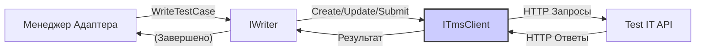
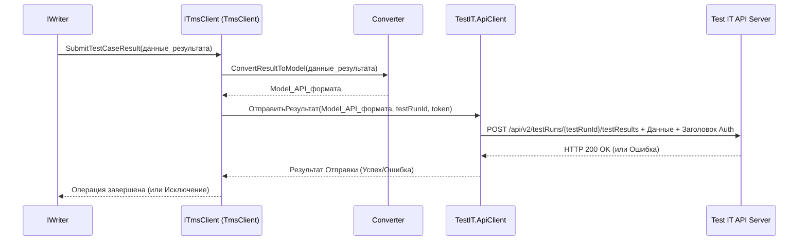

# Chapter 5: Клиент TMS (Test IT)


В [предыдущей главе](04_менеджер_адаптера__core__.md) мы познакомились с "режиссером" наших тестов — Менеджером Адаптера (`AdapterManager`), который управляет всем процессом сбора данных. Он решает, *что* и *когда* нужно записать, но кто же фактически доставляет эту информацию по адресу — на сервер Test IT?

Представьте, что [Менеджер Адаптера](04_менеджер_адаптера__core__.md) подготовил все отчеты и материалы после съемок. Теперь нужен специальный курьер или почтальон, который возьмет эти пакеты данных и надежно доставит их в главный офис (Test IT), а также при необходимости привезет оттуда нужные документы (например, список тестов для запуска).

Этим "почтальоном" в мире `adapters-dotnet` и является **Клиент TMS (Test IT)**.

## Что такое Клиент TMS и зачем он нужен?

**Клиент TMS (Test IT)**, представленный интерфейсом `ITmsClient` и его реализацией `TmsClient`, — это компонент, который отвечает за всё общение с сервером Test IT. Без него адаптер не смог бы ни отправить результаты тестов, ни получить какую-либо информацию из системы управления тестированием.

**Основная задача:** Скрыть все сложности сетевого взаимодействия и работы с API Test IT от остальной части адаптера.

Представьте, что вам нужно отправить посылку в другую страну. Вы не вникаете в детали работы почтовых служб, сортировочных центров, таможни. Вы просто приносите посылку в отделение, заполняете бланк (конфигурацию), а почтальон (Клиент TMS) берет на себя все остальное.

Клиент TMS делает то же самое:
*   Берет подготовленные данные о тестах (результаты, шаги, вложения) от [Менеджера Адаптера](04_менеджер_адаптера__core__.md) (через `IWriter`).
*   Использует [конфигурацию](01_конфигурация_адаптера_.md) (адрес сервера Test IT, секретный токен) для подключения.
*   Формирует специальные запросы (HTTP-запросы) к API Test IT.
*   Отправляет эти запросы по сети.
*   Получает ответы от сервера (успешно отправлено, или произошла ошибка, или запрошенная информация).
*   Обрабатывает эти ответы и возвращает результат вызывающей стороне (например, `IWriter`).

## Ключевые обязанности Клиента TMS

Клиент TMS умеет выполнять множество задач по взаимодействию с Test IT API, включая:

*   **Отправка результатов тестов:** Сообщает Test IT, как прошел конкретный автотест (успешно, упал, пропущен), с каким сообщением, трассировкой ошибки, шагами и ссылками.
*   **Создание и обновление автотестов:** Если автотест еще не существует в Test IT (проверяется по `ExternalId`), клиент может создать его. Если существует — обновить его данные (например, шаги, описание, ссылки).
*   **Загрузка вложений:** Отправляет файлы (скриншоты, логи) на сервер Test IT и получает их уникальные идентификаторы, которые затем прикрепляются к результатам тестов.
*   **Связывание с задачами (Work Items):** Сообщает Test IT, что данный автотест покрывает определенные ручные тест-кейсы или задачи.
*   **Проверка существования автотеста:** Узнает у Test IT, зарегистрирован ли уже автотест с заданным `ExternalId`.
*   **Получение информации об автотесте:** Запрашивает у Test IT данные конкретного автотеста по его `ExternalId`.
*   **(В TmsRunner):** Создание и завершение Тест-Рана (Test Run) – сессии выполнения тестов.

## Как он используется? (Чаще всего неявно)

Хорошие новости: как правило, вам **не нужно напрямую вызывать методы `ITmsClient`**. Как мы видели в [Главе 4](04_менеджер_адаптера__core__.md), `AdapterManager` делегирует задачу отправки данных компоненту `IWriter`, который, в свою очередь, уже использует `ITmsClient` для фактического общения с Test IT.



Вы настраиваете адаптер через [конфигурацию](01_конфигурация_адаптера_.md), используете [атрибуты метаданных](02_аттрибуты_метаданных_test_it_.md), а `AdapterManager`, `IWriter` и `ITmsClient` работают вместе "за кулисами", чтобы ваши результаты попали в Test IT.

## Как это работает "под капотом"?

Давайте заглянем немного глубже и посмотрим, что происходит, когда, например, `IWriter` решает отправить результат теста с помощью `ITmsClient`.

1.  **Получение Задачи:** `IWriter` вызывает метод `ITmsClient`, например, `SubmitTestCaseResult`, передавая ему объект с данными о результате теста ([Модель Данных Теста](06_модели_данных_тестов_.md)).
2.  **Подготовка Запроса:**
    *   `TmsClient` (реализация `ITmsClient`) берет полученные данные.
    *   Он использует вспомогательный класс `Converter`, чтобы преобразовать внутренний формат данных адаптера в формат, понятный библиотеке `TestIT.ApiClient` (которая используется для работы с API).
    *   Он берет адрес сервера (`Url`) и секретный токен (`PrivateToken`) из объекта `TmsSettings` ([конфигурация](01_конфигурация_адаптера_.md)).
3.  **Отправка Запроса:** `TmsClient` использует настроенный `HttpClient` (внутри библиотеки `TestIT.ApiClient`) для отправки HTTP POST-запроса на соответствующий эндпоинт API Test IT (например, `/api/v2/testRuns/{testRunId}/testResults`). В теле запроса передаются преобразованные данные о результате теста. Авторизация происходит с помощью `PrivateToken`.
4.  **Ожидание Ответа:** Клиент ждет ответа от сервера Test IT.
5.  **Обработка Ответа:**
    *   Если сервер вернул успешный ответ (например, HTTP статус 200 OK), `TmsClient` считает операцию выполненной и может вернуть управление `IWriter`.
    *   Если сервер вернул ошибку (например, 401 Unauthorized - неверный токен, 404 Not Found - не найден тест-ран, 500 Internal Server Error), `TmsClient` регистрирует ошибку (пишет в лог) и может выбросить исключение, которое будет обработано выше (`IWriter` или `AdapterManager`).
    *   Если запрашивалась информация (например, `GetAutotestByExternalId`), клиент извлекает данные из тела ответа сервера и возвращает их.

**Упрощенная Диаграмма Последовательности (Отправка результата):**



## Заглянем в Код: Интерфейс и Реализация

Давайте посмотрим на ключевые части кода, связанные с `ITmsClient`.

### Интерфейс `ITmsClient`

Интерфейс определяет "контракт" — какие операции должен уметь выполнять клиент TMS. Находится в `Tms.Adapter.Core/Client/ITmsClient.cs`.

```csharp
// Файл: Tms.Adapter.Core/Client/ITmsClient.cs (Упрощенно)
using Tms.Adapter.Core.Models; // Наши внутренние модели

namespace Tms.Adapter.Core.Client;

public interface ITmsClient
{
    // Существует ли автотест с таким External ID?
    Task<bool> IsAutotestExist(string externalId);

    // Создать новый автотест в Test IT
    Task CreateAutotest(TestContainer result, ClassContainer container);

    // Обновить существующий автотест в Test IT
    Task UpdateAutotest(TestContainer result, ClassContainer container);

    // Отправить результат выполнения теста в указанный TestRun
    Task SubmitTestCaseResult(TestContainer result, ClassContainer container);

    // Загрузить файл как вложение и вернуть его ID
    Task<string> UploadAttachment(string fileName, Stream content);

    // Связать автотест с задачами (Work Items)
    Task LinkAutoTestToWorkItems(string autotestId, IEnumerable<string> workItemIds);

    // (В TmsRunner) Создать новый TestRun
    Task CreateTestRun();

    // (В TmsRunner) Завершить TestRun
    Task CompleteTestRun();

    // Получить данные автотеста по External ID
    Task<TestIT.ApiClient.Model.AutoTestApiResult?> GetAutotestByExternalId(string externalId);

    // ... и другие методы ...
}
```
*Объяснение:* Интерфейс объявляет основные функции, которые клиент предоставляет остальному адаптеру: проверка, создание, обновление автотестов, отправка результатов, загрузка файлов и т.д. Обратите внимание, что методы асинхронные (`Task`), так как сетевые операции могут занимать время.

### Реализация `TmsClient`

Класс `TmsClient` реализует интерфейс `ITmsClient`. Находится в `Tms.Adapter.Core/Client/TmsClient.cs`.

**Конструктор:**

```csharp
// Файл: Tms.Adapter.Core/Client/TmsClient.cs (Конструктор, упрощено)
using Microsoft.Extensions.Logging;
using TestIT.ApiClient.Api;        // API-клиенты из TestIT.ApiClient
using TestIT.ApiClient.Client;   // Базовая конфигурация API-клиента
using Tms.Adapter.Core.Configurator; // Для доступа к TmsSettings

namespace Tms.Adapter.Core.Client;

public class TmsClient : ITmsClient
{
    private readonly ILogger<TmsClient> _logger; // Для записи логов
    private readonly TmsSettings _settings;   // Настройки (URL, Token, ProjectId...)
    private readonly TestRunsApi _testRuns;   // Клиент для API Тест-Ранов
    private readonly AttachmentsApi _attachments; // Клиент для API Вложений
    private readonly AutoTestsApi _autoTests;   // Клиент для API Автотестов

    public TmsClient(ILogger<TmsClient> logger, TmsSettings settings)
    {
        _logger = logger;
        _settings = settings; // Сохраняем настройки

        // 1. Настраиваем базовую конфигурацию API клиента
        var cfg = new Configuration { BasePath = settings.Url }; // Указываем адрес сервера
        cfg.AddApiKeyPrefix("Authorization", "PrivateToken");    // Тип авторизации
        cfg.AddApiKey("Authorization", settings.PrivateToken); // Наш секретный токен

        // 2. Настраиваем HttpClient (для возможности отключить проверку SSL)
        var httpClientHandler = new HttpClientHandler();
        if (!_settings.CertValidation) // Если в настройках отключена валидация сертификата
        {
            // Доверяем любому сертификату (ОПАСНО для production!)
            httpClientHandler.ServerCertificateCustomValidationCallback = (_, _, _, _) => true;
        }

        // 3. Создаем экземпляры API-клиентов, передавая им HttpClient и конфигурацию
        _testRuns = new TestRunsApi(new HttpClient(httpClientHandler), cfg);
        _attachments = new AttachmentsApi(new HttpClient(httpClientHandler), cfg);
        _autoTests = new AutoTestsApi(new HttpClient(httpClientHandler), cfg);

        _logger.LogInformation("Клиент TMS инициализирован для URL: {Url}", settings.Url);
    }

    // ... реализации методов интерфейса ITmsClient ...
}
```
*Объяснение:* Конструктор получает настройки (`TmsSettings`) и логгер. Он использует URL и токен из настроек для конфигурации библиотеки `TestIT.ApiClient`. Важно отметить обработку флага `CertValidation` для случаев с самоподписанными сертификатами. Затем создаются экземпляры для работы с различными частями API Test IT (`_testRuns`, `_attachments`, `_autoTests`).

**Пример: Создание Автотеста:**

```csharp
// Файл: Tms.Adapter.Core/Client/TmsClient.cs (Метод CreateAutotest, упрощено)
public async Task CreateAutotest(TestContainer result, ClassContainer container)
{
    _logger.LogDebug("Создание автотеста {ExternalId}", result.ExternalId);

    try
    {
        // 1. Конвертируем нашу внутреннюю модель в модель API
        var model = Converter.ConvertAutoTestDtoToPostModel(result, container, _settings.ProjectId);

        // 2. Учитываем настройку авто-создания тест-кейсов
        model.ShouldCreateWorkItem = _settings.AutomaticCreationTestCases;

        // 3. Вызываем метод API клиента для создания автотеста
        await _autoTests.CreateAutoTestAsync(model);

        _logger.LogDebug("Автотест {ExternalId} успешно создан", result.ExternalId);
    }
    catch (Exception e)
    {
        _logger.LogError(e, "Ошибка при создании автотеста {ExternalId}", result.ExternalId);
        // Возможно, стоит пробросить исключение дальше
        throw;
    }
}
```
*Объяснение:* Метод получает данные теста (`result`, `container`), использует `Converter` для преобразования их в формат `AutoTestPostModel`, учитывает настройку `AutomaticCreationTestCases` и вызывает асинхронный метод `_autoTests.CreateAutoTestAsync`. Весь процесс логируется.

**Пример: Отправка Результата Теста:**

```csharp
// Файл: Tms.Adapter.Core/Client/TmsClient.cs (Метод SubmitTestCaseResult, упрощено)
public async Task SubmitTestCaseResult(TestContainer result, ClassContainer container)
{
    _logger.LogDebug("Отправка результата теста {ExternalId} в тест-ран {TestRunId}",
                     result.ExternalId, _settings.TestRunId);

    try
    {
        // 1. Конвертируем результат в формат API
        var model = Converter.ConvertResultToModel(result, container, _settings.ConfigurationId);

        // 2. Вызываем метод API клиента для отправки результата
        // Передаем ID тест-рана и список результатов (у нас один)
        await _testRuns.SetAutoTestResultsForTestRunAsync(
            new Guid(_settings.TestRunId), // ID Тест-рана из настроек
            new List<AutoTestResultsForTestRunModel> { model } // Список результатов
        );

        _logger.LogDebug("Результат для {ExternalId} успешно отправлен в тест-ран {TestRunId}",
                         result.ExternalId, _settings.TestRunId);
    }
    catch (Exception e)
    {
        _logger.LogError(e, "Ошибка при отправке результата {ExternalId} в тест-ран {TestRunId}",
                         result.ExternalId, _settings.TestRunId);
        throw;
    }
}
```
*Объяснение:* Похожий процесс: конвертация данных с помощью `Converter`, затем вызов метода `_testRuns.SetAutoTestResultsForTestRunAsync`, передавая ID тест-рана (из настроек) и подготовленную модель результата.

**Пример: Загрузка Вложения:**

```csharp
// Файл: Tms.Adapter.Core/Client/TmsClient.cs (Метод UploadAttachment, упрощено)
using TestIT.ApiClient.Client; // Для FileParameter
using System.IO;              // Для Stream

public async Task<string> UploadAttachment(string fileName, Stream content)
{
    _logger.LogDebug("Загрузка вложения: {Name}", fileName);

    try
    {
        // 1. Вызываем метод API клиента для загрузки файла
        var response = await _attachments.ApiV2AttachmentsPostAsync(
            new FileParameter(
                filename: Path.GetFileName(fileName), // Имя файла
                content: content,                    // Поток с содержимым файла
                contentType: MimeTypes.GetMimeType(fileName) // MIME-тип (определяется по расширению)
            )
        );

        _logger.LogDebug("Вложение {Name} успешно загружено, ID: {AttachmentId}", fileName, response.Id);

        // 2. Возвращаем ID загруженного файла
        return response.Id.ToString();
    }
    catch (Exception e)
    {
        _logger.LogError(e, "Ошибка при загрузке вложения {Name}", fileName);
        throw;
    }
}
```
*Объяснение:* Метод принимает имя файла и поток с его содержимым (`Stream`). Он использует `_attachments.ApiV2AttachmentsPostAsync`, передавая ему специальный объект `FileParameter`. После успешной загрузки API возвращает информацию о файле, включая его уникальный ID, который и возвращает метод.

### Роль Конвертера (`Converter`)

Класс `Converter` (в `Tms.Adapter.Core/Client/Converter.cs`) играет важную, но вспомогательную роль. Он содержит статические методы, которые преобразуют объекты наших внутренних [Моделей Данных Тестов](06_модели_данных_тестов_.md) (например, `TestContainer`, `StepResult`, `Link`) в объекты моделей, ожидаемых библиотекой `TestIT.ApiClient` (например, `AutoTestPostModel`, `AutoTestResultsForTestRunModel`, `LinkPostModel`). Это необходимо, так как наши внутренние модели могут иметь другую структуру или названия полей, чем те, что используются в официальном API Test IT.

Вам не нужно детально разбираться в работе `Converter`, достаточно понимать его назначение — "переводчик" данных между внутренним форматом адаптера и форматом API.

## Заключение

**Клиент TMS (Test IT)** — это незаменимый "почтальон", обеспечивающий связь между вашими тестами и сервером Test IT. Он инкапсулирует всю логику работы с API Test IT, используя настройки адаптера для подключения и авторизации. Клиент отвечает за отправку результатов, создание и обновление автотестов, загрузку вложений и другие взаимодействия с TMS.

Хотя вы редко будете использовать `ITmsClient` напрямую, понимание его функций помогает увидеть полную картину того, как адаптер `adapters-dotnet` интегрирует ваши автотесты с Test IT. Он является мостом между [Менеджером Адаптера](04_менеджер_адаптера__core__.md) (через `IWriter`) и внешним миром Test IT.

В следующей главе мы подробнее рассмотрим структуры данных, которыми оперируют `AdapterManager`, `IWriter` и `ITmsClient` — [Модели Данных Тестов](06_модели_данных_тестов_.md).

---

Generated by [AI Codebase Knowledge Builder](https://github.com/The-Pocket/Tutorial-Codebase-Knowledge)