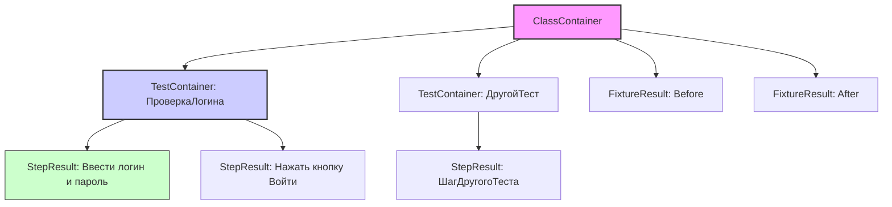
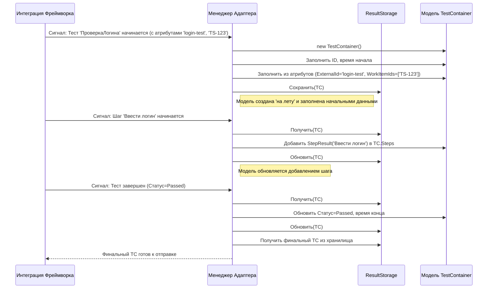

# Chapter 6: Модели Данных Тестов


В [предыдущей главе](05_клиент_tms__test_it__.md) мы узнали о "почтальоне" — [Клиенте TMS (Test IT)](05_клиент_tms__test_it__.md), который отвечает за доставку информации на сервер Test IT. Он знает, *как* отправить данные. Но *что именно* он отправляет? Какова структура этих данных?

Представьте, что вы отправляете международную посылку ([Клиент TMS](05_клиент_tms__test_it__.md) — это курьер). Прежде чем курьер заберет посылку, вам нужно заполнить декларацию: указать отправителя, получателя, содержимое, его ценность и т.д. Без этой декларации посылку не примут.

**Модели Данных Тестов** — это и есть те самые "декларации" для результатов ваших автотестов. Это набор C#-классов, которые служат структурами или формами для хранения всей информации о тесте во время его выполнения: его имя, статус (пройден/упал), шаги, время выполнения, связанные ссылки и многое другое. [Менеджер Адаптера](04_менеджер_адаптера__core__.md) заполняет эти "формы" по ходу теста, а затем передает их "курьеру" ([Клиент TMS](05_клиент_tms__test_it__.md)) для отправки в Test IT.

**Основной сценарий:** Как адаптер представляет информацию о том, что тест `ПроверкаЛогина` успешно пройден за 5 секунд, внутри него был выполнен шаг "Ввести логин и пароль", и он связан с задачей `TS-123` в Test IT? Ответ — с помощью объектов Моделей Данных.

## Что такое Модели Данных Тестов?

Это просто C#-классы, определенные в ядре адаптера (`Tms.Adapter.Core`) и других компонентах. Они действуют как контейнеры или чертежи для данных. Когда ваш тест запускается, адаптер создает экземпляры этих классов и заполняет их свойства информацией, полученной от тестового фреймворка и из ваших [атрибутов метаданных](02_аттрибуты_метаданных_test_it_.md).

Думайте о них как о наборе стандартизированных форм:

*   Одна большая форма для всего тестового метода.
*   Отдельные маленькие формы для каждого шага внутри теста.
*   Еще одна форма для всего тестового класса (если есть общие процедуры подготовки/очистки).

Эти заполненные "формы" (объекты) затем используются для формирования запросов к API Test IT.

## Ключевые Модели ("Формы")

Давайте познакомимся с основными классами моделей данных.

### `ExecutableItem`: Базовый Шаблон

Это абстрактный базовый класс, от которого наследуются почти все остальные модели, представляющие что-то выполняемое (тесты, шаги, фикстуры).

*   **Аналогия:** Общая часть всех форм — поля для указания статуса, времени начала и конца, списка шагов и прикрепленных файлов.

Он содержит общие свойства, такие как:

*   `DisplayName`: Человекочитаемое имя (например, из атрибута `[DisplayName]`).
*   `Description`: Описание (из атрибута `[Description]`).
*   `Status`: Текущий статус выполнения (`Passed`, `Failed`, `Skipped`).
*   `Stage`: Текущая стадия жизненного цикла (`Running`, `Finished`).
*   `Steps`: Список выполненных дочерних шагов (объекты `StepResult`).
*   `Attachments`: Список ID прикрепленных файлов (загруженных через [Клиент TMS](05_клиент_tms__test_it__.md)).
*   `Parameters`: Словарь с параметрами (для параметризованных тестов).
*   `Start`, `Stop`: Время начала и окончания выполнения (в миллисекундах Unix time).

```csharp
// Упрощенный пример из Tms.Adapter.Core/Models/ExecutableItem.cs
namespace Tms.Adapter.Core.Models;

public abstract class ExecutableItem
{
    public string DisplayName { get; set; } // Отображаемое имя
    public string Description { get; set; } // Описание
    public Status Status { get; set; } // Статус: Passed, Failed, Skipped
    public Stage Stage { get; set; } // Стадия: Running, Finished
    public List<StepResult> Steps { get; set; } = new(); // Вложенные шаги
    public List<string> Attachments { get; set; } = new(); // ID вложений
    public Dictionary<string, string> Parameters { get; set; } = new(); // Параметры
    public long Start { get; set; } // Время начала
    public long Stop { get; set; }  // Время окончания
}
```

### `TestContainer`: Главная Форма для Тест-Метода

Этот класс наследуется от `ExecutableItem` и представляет собой основной контейнер информации для конкретного тестового метода (например, помеченного `[TestMethod]` или `[Fact]`).

*   **Аналогия:** Та самая главная "таможенная декларация" для вашей посылки (результата теста). Она содержит всю ключевую информацию.

Помимо свойств из `ExecutableItem`, он добавляет специфичные для теста поля:

*   `Id`: Уникальный идентификатор этого объекта теста (генерируется адаптером).
*   `ExternalId`: **Очень важное поле!** Уникальный ID из атрибута `[ExternalId(...)]`, используемый для связи с тест-кейсом в Test IT. Подробнее в [главе 2](02_аттрибуты_метаданных_test_it_.md).
*   `Title`: Технический заголовок (из атрибута `[Title]`).
*   `WorkItemIds`: Список ID задач (например, ручных тестов) из Test IT, связанных с этим автотестом (из атрибута `[WorkItemIds]`).
*   `ClassName`: Имя класса, где находится тест.
*   `Namespace`: Пространство имен класса.
*   `Labels`: Список меток (из атрибута `[Labels]`).
*   `Links`: Список ссылок на внешние ресурсы (требования, баги), заданных в атрибуте `[Links]`.
*   `ResultLinks`: Ссылки, добавленные динамически во время выполнения теста (через `Adapter.AddLinks`).
*   `Message`: Сообщение об ошибке (если тест упал) или другое информационное сообщение.
*   `Trace`: Трассировка стека ошибки (если тест упал).

```csharp
// Упрощенный пример из Tms.Adapter.Core/Models/TestContainer.cs
namespace Tms.Adapter.Core.Models;

public class TestContainer : ExecutableItem // Наследуется от ExecutableItem
{
    public string Id { get; set; } // Внутренний ID
    public string ExternalId { get; set; } // ID для Test IT (из атрибута)
    public string Title { get; set; } // Заголовок (из атрибута)
    public List<string> WorkItemIds { get; set; } = new (); // Связанные задачи (из атрибута)
    public string ClassName { get; set; } // Имя класса
    public string Namespace { get; set; } // Пространство имён
    public List<string> Labels { get; set; } = new (); // Метки (из атрибута)
    public List<Link> Links { get; set; } = new (); // Ссылки (из атрибута)
    public List<Link> ResultLinks { get; set; } = new (); // Динамические ссылки
    public string Message { get; set; } // Сообщение (ошибки)
    public string? Trace { get; set; } // Трассировка стека
    // ... другие поля ...
}
```
*Ключевое:* `TestContainer` собирает почти всю информацию, которая видна в отчете о тесте в Test IT, включая данные из [атрибутов метаданных](02_аттрибуты_метаданных_test_it_.md).

### `ClassContainer`: Папка для Тестового Класса

Этот контейнер хранит информацию, относящуюся ко всему тестовому классу, в основном о его фикстурах (методах подготовки и очистки).

*   **Аналогия:** Папка, в которую вложены формы `TestContainer` для всех тестов этого класса, а также отдельные листки для общих процедур "До" (`Before`) и "После" (`After`).

Основные свойства:

*   `Id`: Уникальный идентификатор этого контейнера класса.
*   `Befores`: Список результатов выполнения методов подготовки (фикстур "Before"), каждый элемент — это объект `FixtureResult`.
*   `Afters`: Список результатов выполнения методов очистки (фикстур "After"), каждый элемент — это объект `FixtureResult`.
*   `Children`: Список ID дочерних `TestContainer`, принадлежащих этому классу.
*   `Start`, `Stop`: Время начала и окончания выполнения *всех* тестов и фикстур в этом классе.

```csharp
// Упрощенный пример из Tms.Adapter.Core/Models/ClassContainer.cs
namespace Tms.Adapter.Core.Models;

public class ClassContainer
{
    public string Id { get; set; } // Уникальный ID
    public List<FixtureResult> Befores { get; set; } = new (); // Результаты Setup-методов
    public List<FixtureResult> Afters { get; set; } = new (); // Результаты Teardown-методов
    public List<string> Children { get; set; } = new (); // ID дочерних тестов
    public long Start { get; set; } // Время начала
    public long Stop { get; set; } // Время окончания
}
```

### `StepResult`: Форма для Шага Теста

Представляет результат выполнения одного шага внутри теста или фикстуры (обычно это метод, помеченный атрибутом `[Step]`). Наследуется от `ExecutableItem`.

*   **Аналогия:** Детальный листок, описывающий один конкретный этап работы, упомянутый в главной декларации (`TestContainer`).

Использует в основном свойства из `ExecutableItem` (DisplayName, Status, Start, Stop, вложенные Steps, Attachments и т.д.) для описания того, как прошел этот шаг.

```csharp
// Упрощенный пример из Tms.Adapter.Core/Models/StepResult.cs
namespace Tms.Adapter.Core.Models;

// Наследуется от ExecutableItem, содержит всю информацию о шаге
public class StepResult: ExecutableItem
{
    // Дополнительных специфичных полей для шага мало,
    // в основном используются поля базового класса ExecutableItem
}
```

### `FixtureResult`: Форма для Фикстуры (`Before`/`After`)

Очень похож на `StepResult`, но используется для представления результатов выполнения методов подготовки (`[Before]`) и очистки (`[After]`). Также наследуется от `ExecutableItem`.

*   **Аналогия:** Похож на листок для шага, но используется специально для записи результатов стандартных процедур "Подготовка" и "Завершение".

```csharp
// Упрощенный пример из Tms.Adapter.Core/Models/FixtureResult.cs
namespace Tms.Adapter.Core.Models;

// Наследуется от ExecutableItem, используется для Before/After методов
public class FixtureResult : ExecutableItem
{
    // Как и StepResult, в основном использует поля базового класса
}
```

### Другие Вспомогательные Типы

*   **`Status`** (перечисление enum): Определяет возможные исходы выполнения (`Undefined`, `Failed`, `Passed`, `Skipped`).
*   **`Stage`** (перечисление enum): Определяет стадию жизненного цикла (`Running`, `Finished`).
*   **`Link`**: Класс для представления ссылки (URL, заголовок, описание, тип). Используется в `TestContainer` и `ExecutableItem` (через `Adapter.AddLinks`).

## Как Они Используются? (Решение Нашего Примера)

Важно понимать: вам, как пользователю адаптера, **обычно не нужно создавать или изменять эти объекты вручную**. [Менеджер Адаптера (Core)](04_менеджер_адаптера__core__.md) делает это за вас, реагируя на события тестового фреймворка и ваши атрибуты.

Давайте вернемся к нашему примеру: тест `ПроверкаЛогина` успешно пройден за 5 секунд, внутри был шаг "Ввести логин и пароль", связь с `TS-123`.

1.  **Начало теста:** `AdapterManager` создает объект `TestContainer`.
2.  **Чтение атрибутов:** Он находит атрибуты на методе `ПроверкаЛогина` (например, `[ExternalId("login-test")]`, `[DisplayName("Проверка Логина")]`, `[WorkItemIds("TS-123")]`). Он заполняет соответствующие поля в объекте `TestContainer`: `ExternalId = "login-test"`, `DisplayName = "Проверка Логина"`, `WorkItemIds = ["TS-123"]`.
3.  **Начало шага:** Вызывается метод, помеченный `[Step]` (например, `ВвестиЛогинИПароль`). `AdapterManager` создает объект `StepResult`, устанавливает его `DisplayName` (например, "Ввести логин и пароль") и добавляет его в список `Steps` внутри `TestContainer`.
4.  **Завершение шага:** Метод `ВвестиЛогинИПароль` успешно завершается. `AdapterManager` обновляет `Status` у `StepResult` на `Passed` и записывает время выполнения.
5.  **Завершение теста:** Метод `ПроверкаЛогина` успешно завершается. `AdapterManager` обновляет `Status` у `TestContainer` на `Passed`, записывает общее время выполнения (например, 5000 миллисекунд).
6.  **Отправка:** `AdapterManager` передает готовый, заполненный объект `TestContainer` (который содержит внутри себя `StepResult`) компоненту `IWriter`.
7.  `IWriter` использует [Клиент TMS (Test IT)](05_клиент_tms__test_it__.md) для отправки информации из этого `TestContainer` на сервер Test IT.

Визуально связь между объектами можно представить так:


*Объяснение:* `ClassContainer` содержит один или несколько `TestContainer` и `FixtureResult`. Каждый `TestContainer` (или `FixtureResult`) может содержать список `StepResult`.

## Как Это Работает "Под Капотом"? Создание и Заполнение

Как же `AdapterManager` создает и заполняет эти объекты? Рассмотрим на примере `TestContainer`.

1.  **Событие:** Тестовый фреймворк (например, XUnit через свою [интеграцию](03_интеграция_с_фреймворком__на_примере_xunit__.md)) сообщает адаптеру о начале теста.
2.  **Вызов Менеджера:** Интеграция (например, `TmsXunitHelper`) вызывает метод `AdapterManager.StartTestCase()`.
3.  **Создание Объекта:** Внутри `StartTestCase`, `AdapterManager` создает новый экземпляр `TestContainer` с помощью `new TestContainer()`. Он присваивает ему уникальный `Id` и записывает время начала (`Start`).
4.  **Чтение Атрибутов:** Интеграция (или сам `AdapterManager`) использует рефлексию .NET для "осмотра" метода теста и чтения [атрибутов метаданных Test IT](02_аттрибуты_метаданных_test_it_.md). Значения из атрибутов (`ExternalId`, `DisplayName`, `WorkItemIds`, `Links`, `Labels` и т.д.) записываются в соответствующие свойства созданного объекта `TestContainer`.
5.  **Хранение:** `AdapterManager` помещает созданный и частично заполненный `TestContainer` во временное хранилище (`ResultStorage`), чтобы иметь к нему доступ во время выполнения теста (например, для добавления шагов или результата).
6.  **Обновление по Ходу:** Во время выполнения теста и его шагов `AdapterManager` обновляет этот объект в `ResultStorage`: добавляет `StepResult`, обновляет `Status`, записывает сообщения об ошибках (`Message`, `Trace`).
7.  **Завершение:** Когда тест завершается, `AdapterManager` устанавливает финальный `Status` и время `Stop`, а затем передает готовый объект "писателю" (`IWriter`).

**Упрощенная Диаграмма Последовательности:**



**Где найти код:** Все эти классы моделей находятся в папке `Tms.Adapter.Core/Models/` вашего проекта `adapters-dotnet`.

*Примечание:* В инструменте [TmsRunner (Запускатель тестов MSTest/NUnit)](07_tmsrunner__запускатель_тестов_mstest_nunit__.md) используются немного другие, но очень похожие модели данных (например, `AutoTest`, `AutoTestResult` в `TmsRunner/Entities/AutoTest/`). Они служат той же цели — структурировать информацию о тесте для отправки в Test IT, но могут объединять в себе описание теста и его результат.

## Заключение

Модели Данных Тестов — это C#-классы, которые служат "формами" или "чертежами" для структурирования всей информации о выполнении ваших автотестов, шагов и фикстур. Ключевыми моделями являются `ExecutableItem` (базовый), `TestContainer` (для теста), `ClassContainer` (для класса), `StepResult` (для шага) и `FixtureResult` (для фикстуры).

Эти модели автоматически создаются и заполняются [Менеджером Адаптера](04_менеджер_адаптера__core__.md) на основе событий от тестового фреймворка и ваших [атрибутов метаданных](02_аттрибуты_метаданных_test_it_.md). Понимание их структуры помогает лучше представить, какая именно информация отправляется в Test IT и как на нее влияют атрибуты.

Теперь, когда мы знаем, *как* структурированы данные о тестах, в следующей главе мы рассмотрим конкретный инструмент, [TmsRunner (Запускатель тестов MSTest/NUnit)](07_tmsrunner__запускатель_тестов_mstest_nunit__.md), который использует все описанные ранее концепции (конфигурацию, атрибуты, менеджер, клиент, модели) для интеграции тестов, написанных на MSTest или NUnit.

---

Generated by [AI Codebase Knowledge Builder](https://github.com/The-Pocket/Tutorial-Codebase-Knowledge)