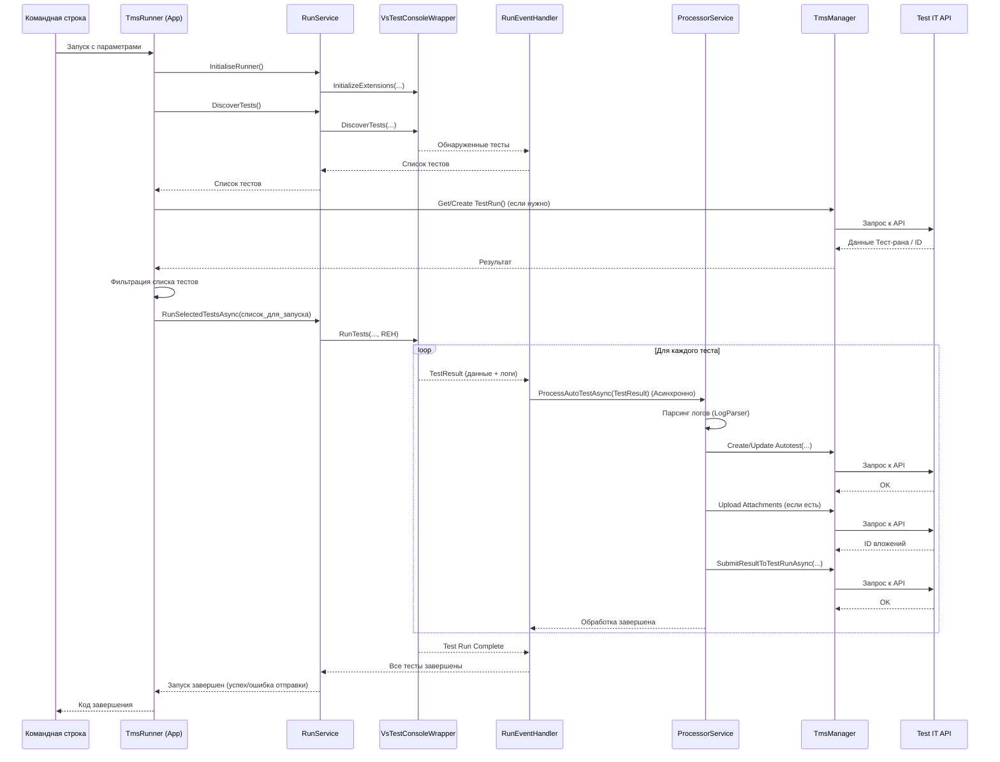

# Chapter 7: TmsRunner (Запускатель тестов MSTest/NUnit)


В [предыдущей главе](06_модели_данных_тестов_.md) мы рассмотрели, как адаптер структурирует информацию о тестах с помощью [Моделей Данных Тестов](06_модели_данных_тестов_.md). Теперь давайте познакомимся с удобным инструментом, который позволяет запускать ваши MSTest и NUnit тесты и отправлять их результаты, упакованные в эти модели, прямо в Test IT — **TmsRunner**.

Представьте, у вас есть набор автотестов, написанных на MSTest или NUnit. Вы хотите запускать их автоматически, например, в вашей системе непрерывной интеграции (CI/CD), и видеть подробные результаты в Test IT. Как это сделать максимально просто, особенно если вы не хотите глубоко модифицировать свой тестовый проект для интеграции?

**TmsRunner** — это ответ! Это специальное **консольное приложение**, созданное как раз для этой задачи. Оно выступает в роли умного "переходника" или моста между стандартным инструментом запуска тестов .NET (`vstest.console`) и вашей системой Test IT.

## Зачем Нужен TmsRunner?

Основная идея TmsRunner — предоставить простой способ запуска тестов MSTest/NUnit с интеграцией Test IT прямо из командной строки. Он берет на себя всю работу по:

1.  **Обнаружению** ваших тестов в указанной сборке (`.dll`).
2.  **Фильтрации** тестов (если вы указали конкретный Тест-ран в Test IT, TmsRunner запустит только тесты, которые в него входят).
3.  **Запуску** выбранных тестов с помощью стандартного `vstest.console`.
4.  **Сбору** детальной информации о результатах, включая шаги, ошибки, ссылки (используя специальный логгер `Tms.Adapter`, который работает вместе с `vstest.console`).
5.  **Обработке** этих результатов и **отправке** их в Test IT.

Вам не нужно вручную настраивать `vstest.console` или писать сложный скрипт для отправки результатов. TmsRunner делает это за вас.

## Как Работает TmsRunner? Ключевые Этапы

Давайте разберем по шагам, что происходит, когда вы запускаете TmsRunner:

1.  **Запуск из Командной Строки:** Вы вызываете TmsRunner (`dotnet TmsRunner.dll ...`), передавая ему необходимые параметры, такие как путь к вашим тестам и настройки для подключения к Test IT.

    ```bash
    # Очень упрощенный пример
    dotnet TmsRunner.dll --testassembly "Путь/К/Вашим/Тестам.dll" --tmsUrl "https://адрес.testit" --tmsPrivateToken "ВАШ_ТОКЕН" # ...другие параметры
    ```

2.  **Конфигурация:** TmsRunner собирает настройки для подключения к Test IT. Он использует те же источники, что и обычный адаптер ([см. Главу 1: Конфигурация Адаптера](01_конфигурация_адаптера_.md)):
    *   **Аргументы командной строки** (Имеют наивысший приоритет! Например, `--tmsUrl`, `--tmsProjectId`).
    *   Переменные окружения (например, `TMS_URL`, `TMS_PRIVATE_TOKEN`).
    *   Файл `Tms.config.json`.

3.  **Обнаружение Тестов:** TmsRunner использует `vstest.console` для сканирования указанной вами сборки (`.dll`) и находит все тесты MSTest/NUnit. Это происходит внутри `RunService` с помощью `DiscoveryEventHandler`.

4.  **Фильтрация Тестов (при необходимости):**
    *   **Режим 0 (`AdapterMode = 0`):** Если вы указали ID существующего Тест-рана (`--tmsTestRunId`), TmsRunner обратится к Test IT (через `TmsManager`) и получит список `ExternalId` тестов, которые должны быть запущены в рамках этого Тест-рана. Затем он отфильтрует найденные на шаге 3 тесты, оставив только те, что соответствуют списку из Test IT. Этим занимается `FilterService`.
    *   **Режим 2 (`AdapterMode = 2`):** TmsRunner сначала создает *новый* Тест-ран в Test IT (используя `--tmsTestRunName`, если он задан). Затем он может либо запустить все найденные тесты, либо отфильтровать их по меткам, если указан параметр `--tmsLabelsOfTestsToRun`.

5.  **Выполнение Тестов:** TmsRunner передает команду на запуск отфильтрованных тестов утилите `vstest.console`. Важно, что при этом он указывает `vstest.console` использовать специальный **логгер** из `Tms.Adapter`. Этот логгер перехватывает события тестов (начало, конец, шаги, ошибки) и выводит их в стандартный поток вывода в особом формате. Этим управляет `RunService` с помощью `RunEventHandler`.

6.  **Сбор и Парсинг Результатов:** `RunEventHandler` получает результаты от `vstest.console`, включая стандартный вывод, где логгер `Tms.Adapter` оставил свои "улики" о шагах, параметрах, ссылках (как мы обсуждали в [главе 2](02_аттрибуты_метаданных_test_it_.md)). `ProcessorService` использует `LogParser` для разбора этих "улик" и восстановления полной картины выполнения теста.

7.  **Обработка и Отправка:** `ProcessorService` берет разобранную информацию о тесте и его результате. Он общается с Test IT через `TmsManager` для:
    *   Проверки, существует ли автотест с таким `ExternalId`.
    *   Создания или обновления автотеста в Test IT.
    *   Загрузки вложений (скриншотов, логов), если они были прикреплены во время теста.
    *   Отправки финального результата (пройден/упал/пропущен, шаги, ссылки, сообщение об ошибке и т.д.) в нужный Тест-ран (`TestRunId`). Используются модели данных, похожие на [Модели Данных Тестов](06_модели_данных_тестов_.md), например, `AutoTest` и `AutoTestResult`.

**Диаграмма Процесса:**

```mermaid
graph LR
    A[Командная строка] --> B(TmsRunner);
    B -- 1. Конфигурация --> C{Настройки Test IT};
    B -- 2. Обнаружение --> D[vstest.console Discovery];
    D --> E{Список всех тестов};
    B -- 3. Фильтрация --> F{Test IT API (TmsManager)};
    F --> G{Список тестов для запуска};
    E & G --> H{Отфильтрованный список тестов};
    B -- 4. Выполнение --> I(vstest.console Run + Tms.Adapter Logger);
    I --> J{Результаты + логи с 'уликами'};
    B -- 5. Парсинг (LogParser) --> K{Структурированные данные теста};
    B -- 6. Обработка (ProcessorService) --> F;
    F -- 7. Отправка --> L[Результаты в Test IT];

    style B fill:#f9f,stroke:#333,stroke-width:2px
    style I fill:#ccf,stroke:#333,stroke-width:1px
    style J fill:#ccf,stroke:#333,stroke-width:1px
    style K fill:#cfc,stroke:#333,stroke-width:1px
```

## Как Использовать TmsRunner

1.  **Получение:** TmsRunner обычно является частью `adapters-dotnet` или может распространяться как отдельный пакет инструментов. Вам понадобится `TmsRunner.dll` и его зависимости.
2.  **Подготовка Тестов:** Убедитесь, что ваши MSTest/NUnit тесты используют [Аттрибуты Метаданных Test IT](02_аттрибуты_метаданных_test_it_.md) (особенно `[ExternalId]`), чтобы TmsRunner мог правильно связать их с тест-кейсами в Test IT. Если вы хотите видеть шаги, используйте `Console.WriteLine` со специальными префиксами из `Tms.Adapter` или атрибут `[Step]` (требует настройки `Tms.Adapter.Fody`).
3.  **Запуск из Командной Строки:**

    Откройте терминал или командную строку, перейдите в каталог с `TmsRunner.dll` и выполните команду, похожую на эту:

    ```bash
    dotnet TmsRunner.dll ^
        --runner "C:\Program Files\Microsoft Visual Studio\2022\Enterprise\Common7\IDE\Extensions\TestPlatform\vstest.console.exe" ^
        --testassembly "D:\МоиПроекты\МойТестовыйПроект\bin\Debug\net8.0\МойТестовыйПроект.dll" ^
        --tmsUrl "https://demo.testit.software" ^
        --tmsPrivateToken "Ваш_Очень_Секретный_Токен" ^
        --tmsProjectId "id-вашего-проекта-guid" ^
        --tmsConfigurationId "id-конфигурации-guid" ^
        --tmsTestRunId "id-существующего-тест-рана-guid" ^
        --tmsAdapterMode 0
        # Другие параметры, если нужно:
        # --tmsConfigFile "путь/к/Tms.config.json"
        # --tmsTestRunName "Имя нового тест-рана" (для режима 2)
        # --tmsLabelsOfTestsToRun "smoke,api" (для режима 2)
        # --testadapterpath "путь/к/адаптерам/ MSTest/NUnit"
        # --loggerpath "путь/к/Tms.Adapter.dll"
    ```

    **Важные аргументы:**

    *   `--runner`: Путь к `vstest.console.exe` (обычно идет с Visual Studio или .NET SDK). **Обязательный**.
    *   `--testassembly`: Путь к вашей `.dll` с тестами. **Обязательный**.
    *   `--tmsUrl`, `--tmsPrivateToken`, `--tmsProjectId`, `--tmsConfigurationId`: Настройки для подключения к Test IT ([см. Главу 1](01_конфигурация_адаптера_.md)). Можно задать через переменные окружения или `Tms.config.json`.
    *   `--tmsTestRunId`: ID существующего тест-рана в Test IT (используется в режиме 0).
    *   `--tmsTestRunName`: Имя для *нового* тест-рана (используется в режиме 2).
    *   `--tmsAdapterMode`: Режим работы (0 - использовать существующий тест-ран, 2 - создать новый).
    *   `--testadapterpath`: Путь к папке с адаптерами тестовых фреймворков (MSTest, NUnit). Часто `vstest.console` находит их сам, но иногда нужно указать явно.
    *   `--loggerpath`: Путь к `Tms.Adapter.dll`. **Важно**, чтобы TmsRunner мог подключить логгер для сбора детальных результатов.

4.  **Просмотр Результатов:** После выполнения команды TmsRunner выведет логи в консоль, а результаты появятся в указанном или созданном Тест-ране в вашем Test IT.

## Внутреннее Устройство: Краткий Обзор Кода

Давайте посмотрим на некоторые ключевые фрагменты кода, чтобы лучше понять, как TmsRunner работает изнутри.

**1. Точка Входа (`Program.cs`)**

Здесь происходит настройка приложения: парсинг аргументов командной строки, настройка логирования и **Внедрение Зависимостей (Dependency Injection - DI)**. DI — это механизм, который автоматически создает и связывает нужные компоненты (сервисы, менеджеры).

```csharp
// Упрощено из TmsRunner/Program.cs
public static class Program
{
    public static async Task<int> Main(string[] args)
    {
        // Создаем "хост" приложения - каркас для запуска
        using var host = CreateHostBuilder(args).Build();
        // Получаем главный класс App и запускаем его
        return await host.Services.GetRequiredService<App>().RunAsync();
    }

    // Метод настройки хоста и сервисов
    private static IHostBuilder CreateHostBuilder(string[] args)
    {
        return Host.CreateDefaultBuilder()
            .UseSerilog(...) // Настройка логирования
            .ConfigureServices((hostContext, services) =>
            {
                // Добавляем конфигурацию адаптера, полученную из аргументов
                _ = services.AddSingleton(GetAdapterConfiguration(args));
                // Добавляем настройки TmsSettings (собранные из разных источников)
                _ = services.AddSingleton(provider => ConfigurationManager.Configure(...));
                // Добавляем HTTP клиент для API TestIT
                _ = services.AddHttpClient(...);
                // Добавляем клиенты для разных частей API TestIT (Attachments, AutoTests, TestRuns)
                _ = services.AddTransient<IAttachmentsApiAsync, AttachmentsApi>(...);
                _ = services.AddTransient<IAutoTestsApiAsync, AutoTestsApi>(...);
                _ = services.AddTransient<ITestRunsApiAsync, TestRunsApi>(...);
                // Регистрируем НАШИ сервисы и менеджеры
                _ = services.AddTransient<App>();            // Главный класс приложения
                _ = services.AddTransient<TmsManager>();     // Для общения с TestIT API
                _ = services.AddTransient<RunService>();     // Для запуска тестов через vstest
                _ = services.AddTransient<ProcessorService>();// Для обработки результатов
                _ = services.AddTransient<LogParser>();      // Для парсинга логов
                _ = services.AddTransient<FilterService>();  // Для фильтрации тестов
                _ = services.AddTransient<DiscoveryEventHandler>(); // Обработчик обнаружения
                _ = services.AddTransient<RunEventHandler>(); // Обработчик выполнения
                _ = services.AddTransient<IVsTestConsoleWrapper, VsTestConsoleWrapper>(...); // Обертка над vstest
            });
    }
    // ... GetAdapterConfiguration - парсит аргументы командной строки ...
}
```
*Объяснение:* `Program.cs` инициализирует все необходимые компоненты (сервисы), используя DI. Когда запрашивается `App`, DI создает его и автоматически передает ему все зависимости (TmsManager, RunService и т.д.). Это делает код более модульным и тестируемым.

**2. Основная Логика (`App.cs`)**

Класс `App` содержит метод `RunAsync`, который координирует весь процесс.

```csharp
// Упрощено из TmsRunner/App.cs
public class App(/* Зависимости передаются DI: logger, tmsManager, runService, filterService ... */)
{
    public async Task<int> RunAsync()
    {
        logger.LogInformation("Adapter works in {Mode} mode", tmsSettings.AdapterMode);

        // 1. Инициализация запускателя vstest
        runService.InitialiseRunner();
        // 2. Обнаружение всех тестов в сборке
        var allTestCases = runService.DiscoverTests();
        logger.LogInformation("Discovered Tests Count: {Count}", allTestCases.Count);

        List<TestCase> testsToRun = allTestCases;
        TestRunV2ApiResult? testRun = null;

        // 3. Логика в зависимости от режима
        switch (tmsSettings.AdapterMode)
        {
            case 0: // Используем существующий тест-ран
                testRun = await tmsManager.GetTestRunAsync(tmsSettings.TestRunId);
                var testIdsFromTms = tmsManager.GetAutoTestsForRunAsync(testRun);
                // Фильтруем тесты по списку из Test IT
                testsToRun = filterService.FilterTestCases(..., testIdsFromTms, allTestCases);
                break;
            case 2: // Создаем новый тест-ран
                testRun = await tmsManager.CreateTestRunAsync();
                tmsSettings.TestRunId = testRun!.Id.ToString(); // Сохраняем ID нового рана
                // Возможно, фильтруем по меткам, если указано
                if (!string.IsNullOrEmpty(adapterConfig.TmsLabelsOfTestsToRun)) {
                    testsToRun = filterService.FilterTestCasesByLabels(...);
                }
                break;
        }

        logger.LogInformation("Running tests: {Count}", testsToRun.Count);

        // 4. Запуск выбранных тестов (возможно с перезапусками)
        bool runSuccess = await runService.RunSelectedTestsAsync(testsToRun) ;
           // В RunSelectedTestsAsync вызывается RunEventHandler,
           // который асинхронно вызывает ProcessorService для каждого результата

        if (tmsSettings.AdapterMode == 2) {
           // Логируем ссылку на созданный тест-ран
           logger.LogInformation("Test run ... finished.");
        }

        // Возвращаем код завершения (0 - успех, 1 - ошибка)
        return runSuccess ? 0 : 1;
    }
}
```
*Объяснение:* `App.RunAsync` выполняет шаги: инициализация, обнаружение, фильтрация (в зависимости от режима), запуск. Сам запуск и обработка результатов происходят асинхронно внутри `RunService` и `RunEventHandler`.

**3. Запуск Тестов (`RunService.cs`)**

Этот сервис отвечает за взаимодействие с `vstest.console` через `IVsTestConsoleWrapper`.

```csharp
// Упрощено из TmsRunner/Services/RunService.cs
public sealed class RunService(/* Зависимости: logger, consoleWrapper, config, discoveryEventHandler, runEventHandler */)
{
    // Инициализация vstest и расширений (логгера Tms.Adapter)
    public void InitialiseRunner()
    {
        consoleWrapper.StartSession();
        // ... consoleWrapper.InitializeExtensions(...); ...
    }

    // Обнаружение тестов
    public List<TestCase> DiscoverTests()
    {
        // Запускаем обнаружение через vstest, результаты собирает discoveryEventHandler
        consoleWrapper.DiscoverTests([config.TestAssemblyPath], ..., discoveryEventHandler);
        // Ждем завершения обнаружения
        discoveryEventHandler.WaitForEnd();
        // Возвращаем найденные тесты
        return discoveryEventHandler.GetTestCases();
    }

    // Запуск выбранных тестов
    public async Task<bool> RunSelectedTestsAsync(IEnumerable<TestCase> testCases)
    {
        // Запускаем тесты через vstest, результаты обрабатывает runEventHandler
        consoleWrapper.RunTests(testCases, config.TmsRunSettings, runEventHandler);
        // Ждем завершения выполнения
        runEventHandler.WaitForEnd();
        // Ждем, пока все результаты будут обработаны и отправлены в Test IT (асинхронно в RunEventHandler)
        await Task.WhenAll(runEventHandler.GetProcessTestResultsTasks());
        // Возвращаем true, если не было ошибок при ОТПРАВКЕ результатов
        return !runEventHandler.HasUploadErrors;
    }
    // ... методы для перезапуска упавших тестов ...
}
```
*Объяснение:* `RunService` использует `consoleWrapper` для вызова `vstest.console` и передает ему специальные обработчики (`discoveryEventHandler`, `runEventHandler`), которые получат результаты и сигналы о завершении.

**4. Обработка Результатов (`RunEventHandler.cs`)**

Этот обработчик получает уведомления от `vstest.console` о завершении тестов и инициирует их обработку.

```csharp
// Упрощено из TmsRunner/Handlers/RunEventHandler.cs
public sealed class RunEventHandler(/* Зависимости: logger, waitHandle, processorService */) : ITestRunEventsHandler, IDisposable
{
    private readonly List<Task> _processTestResultsTasks = []; // Задачи на обработку результатов
    private bool _hasUploadErrors; // Флаг ошибок при отправке

    // Вызывается, когда появляются новые результаты тестов
    public void HandleTestRunStatsChange(TestRunChangedEventArgs? testRunChangedArgs)
    {
        if (testRunChangedArgs?.NewTestResults == null) return;
        // Запускаем асинхронную обработку для КАЖДОГО результата
        _processTestResultsTasks.Add(ProcessTestResultsAsync(testRunChangedArgs.NewTestResults));
    }

    // Вызывается при полном завершении тест-рана
    public void HandleTestRunComplete(...)
    {
        // Обрабатываем последнюю пачку результатов, если есть
        if (lastChunkArgs ...) {
             _processTestResultsTasks.Add(ProcessTestResultsAsync(lastChunkArgs.NewTestResults));
        }
        logger.LogDebug("Test Run completed");
        // Сигнализируем, что выполнение тестов завершено
        _ = waitHandle.Set();
    }

    // Асинхронный метод обработки пачки результатов
    private async Task ProcessTestResultsAsync(IEnumerable<TestResult?>? testResults)
    {
        if (testResults == null) return;

        foreach (var testResult in testResults)
        {
            if (testResult == null) continue;
            logger.LogDebug("Start test '{Name}' upload", testResult.DisplayName);
            try
            {
                // Вызываем ProcessorService для обработки и отправки ОДНОГО результата
                await processorService.ProcessAutoTestAsync(testResult);
                logger.LogInformation("Success test '{Name}' upload", testResult.DisplayName);
            }
            catch (Exception e)
            {
                _hasUploadErrors = true; // Запоминаем, если была ошибка отправки
                logger.LogError(e, "Failed test '{Name}' upload", testResult.DisplayName);
            }
        }
    }

    // ... другие методы интерфейса ITestRunEventsHandler ...
    public void WaitForEnd() { _ = waitHandle.WaitOne(); } // Ожидание сигнала о завершении
    public List<Task> GetProcessTestResultsTasks() { return _processTestResultsTasks; } // Вернуть список задач обработки
    public bool HasUploadErrors => _hasUploadErrors; // Доступ к флагу ошибок
}
```
*Объяснение:* `RunEventHandler` асинхронно запускает `processorService.ProcessAutoTestAsync` для каждого полученного `TestResult`. Он также использует `EventWaitHandle` для синхронизации с основным потоком TmsRunner.

**5. Обработка Одного Теста (`ProcessorService.cs`)**

Этот сервис получает `TestResult`, парсит его логи, общается с Test IT и отправляет финальный результат.

```csharp
// Упрощено из TmsRunner/Services/ProcessorService.cs
public sealed class ProcessorService(/* Зависимости: logger, apiClient (TmsManager), tmsSettings, parser (LogParser) */)
{
    public async Task ProcessAutoTestAsync(TestResult testResult)
    {
        // 1. Извлекаем "сырой" лог из результата
        var traceJson = GetTraceJson(testResult);
        // 2. Парсим параметры из лога
        var parameters = LogParser.GetParameters(traceJson);
        // 3. Парсим основную информацию об автотесте (из атрибутов/рефлексии)
        var autoTest = parser.GetAutoTest(testResult, parameters);
        autoTest.Message = LogParser.GetMessage(traceJson); // Парсим сообщения

        var attachmentIds = new List<Guid>();
        // 4. Асинхронно парсим шаги и загружаем вложения из лога
        var steps = await GetStepsWithAttachmentsAsync(traceJson, attachmentIds);
        // ... распределяем шаги по Setup/Steps/Teardown в autoTest ...

        // 5. Проверяем/Создаем/Обновляем автотест в Test IT
        var existAutotestResult = await apiClient.GetAutotestByExternalIdAsync(autoTest.ExternalId);
        if (existAutotestResult == null) {
            await apiClient.CreateAutotestAsync(autoTest);
        } else {
            await apiClient.UpdateAutotestAsync(autoTest);
        }

        // 6. Связываем с Work Items, если нужно
        if (autoTest.WorkItemIds.Count > 0) { /* ... apiClient.LinkAutoTestToWorkItemAsync ... */ }

        // 7. Формируем модель результата для отправки в Test IT
        var autoTestResultRequestBody = GetAutoTestResultsForTestRunModel(
            autoTest, testResult, traceJson, steps, attachmentIds, parameters, ...);

        // 8. Отправляем результат в Test IT
        await apiClient.SubmitResultToTestRunAsync(tmsSettings.TestRunId, autoTestResultRequestBody);
    }

    // ... private async Task<List<Step>> GetStepsWithAttachmentsAsync(...) - парсит шаги и грузит аттачи ...
    // ... private static AutoTestResult GetAutoTestResultsForTestRunModel(...) - собирает модель для API ...
    // ... private static string GetTraceJson(...) - извлекает лог из TestResult.Messages ...
}
```
*Объяснение:* `ProcessorService` выполняет ключевую работу по превращению `TestResult` от `vstest.console` в полноценный результат в Test IT, включая обработку шагов, вложений и взаимодействие с API через `TmsManager`.

**Упрощенная Диаграмма Последовательности:**



## Заключение

**TmsRunner** — это мощный и удобный инструмент для интеграции ваших MSTest и NUnit тестов с Test IT без необходимости сложной настройки. Он работает как консольное приложение, управляя всем процессом от обнаружения до отправки результатов, используя стандартный `vstest.console` и специальный логгер `Tms.Adapter`.

В этой главе мы узнали:

*   Что такое TmsRunner и какие проблемы он решает.
*   Как он работает на высоком уровне: запуск, конфигурация, обнаружение, фильтрация, выполнение, сбор, парсинг и отправка.
*   Как его использовать из командной строки с основными параметрами.
*   Заглянули "под капот", чтобы увидеть ключевые компоненты (`App`, `RunService`, `RunEventHandler`, `ProcessorService`, `LogParser`, `TmsManager`) и как они взаимодействуют.

TmsRunner эффективно объединяет концепции, рассмотренные в предыдущих главах: [Конфигурацию](01_конфигурация_адаптера_.md), [Аттрибуты](02_аттрибуты_метаданных_test_it_.md), [Клиент TMS](05_клиент_tms__test_it_.md) и [Модели Данных](06_модели_данных_тестов_.md) для обеспечения бесшовной интеграции ваших тестов с Test IT.

На этом мы завершаем наше введение в основные компоненты и возможности `adapters-dotnet`. Надеемся, это руководство поможет вам успешно интегрировать ваши автотесты с Test IT!

---

Generated by [AI Codebase Knowledge Builder](https://github.com/The-Pocket/Tutorial-Codebase-Knowledge)