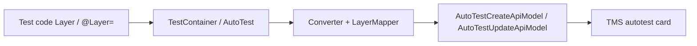

# Autotest layer (test pyramid) — specification of implemented changes

Feature: optional **test pyramid layer** on an **autotest** card, declared in test code and sent on create/update via adapters API.  
Cross-product spec: [tz-autotest-layer.md](./tz-autotest-layer.md).

## Purpose

TMS shows a pyramid layer on each autotest (Unit, API, E2E, etc.). Adapters can set it during a run with source **`Run`** (distinct from Manual / Rule / Report).

| Declared in test | Adapter behaviour |
|------------------|-------------------|
| Layer set | **Create:** send `layer: { name, source: Run }` |
| Layer set | **Update:** send `layer` + **`resetLayer: false`** |
| Layer not set | **Update:** send **`resetLayer: false`** only; omit `layer` |

Layer is **not** configurable via env/CLI/config file — only from test code (attribute / Gherkin tag).

## Declaration by adapter

| Adapter | Syntax |
|---------|--------|
| MSTest / NUnit (`Tms.Adapter`) | `[Layer("API")]` or `[Layer(TestLayers.API)]` on test method |
| xUnit (`Tms.Adapter.XUnit`) | `[Layer("API")]` — attribute from `Tms.Adapter.Core.Attributes` |
| SpecFlow | `@Layer=API` on scenario or feature |
| TmsRunner (reflection path) | Same `[Layer]` as MSTest/NUnit — read from test method via `LogParser` |

Recommended constants (`Tms.Adapter.Core.Models.TestLayers`): `E2E`, `UI`, `API`, `Contract`, `Integration`, `Component`, `Unit`. Any other non-empty string is accepted.

### Examples

**MSTest / NUnit / xUnit**

```csharp
using Tms.Adapter.Attributes;           // MSTest / NUnit
using Tms.Adapter.Core.Attributes;      // xUnit
using Tms.Adapter.Core.Models;

[Layer(TestLayers.API)]
[Test]
public void CreateUser() { }

[Layer("my-custom-layer")]
[Test]
public void CustomLayer() { }
```

**SpecFlow**

```gherkin
@Layer=API
Scenario: API level test
  Then return true
```

## API mapping

Uses existing autotest endpoints and `LayerApiModel`:

```json
{
  "layer": {
    "name": "API",
    "source": "Run"
  },
  "resetLayer": false
}
```

`resetLayer` is sent on every **update** (`AutoTestUpdateApiModel`). `layer` is included only when the test declares a non-empty value.

**Out of scope:** layer on test run, layer on test result entity, config/env defaults, `Adapter.addLayer()` at runtime, `resetLayer: true` when annotation is absent.

## Code locations

| Area | Files |
|------|--------|
| Attribute + constants | `Tms.Adapter.Core/Attributes/LayerAttribute.cs`, `Tms.Adapter.Core/Models/TestLayers.cs` |
| MSTest/NUnit attribute | `Tms.Adapter/Attributes/LayerAttribute.cs` |
| Internal model | `Tms.Adapter.Core/Models/TestContainer.cs` (`Layer` property) |
| API mapping | `Tms.Adapter.Core/Utils/LayerMapper.cs` |
| Core converter | `Tms.Adapter.Core/Client/Converter.cs` |
| Failed-test PATCH | `Tms.Adapter.Core/Client/TmsClient.cs` (`UpdateAutotest` minimal path: `resetLayer` + optional `layer`) |
| Writer | `Tms.Adapter.Core/Writer/Writer.cs` — passes `result.Layer` on failed minimal update |
| xUnit extraction | `Tms.Adapter.XUnit/TmsXunitHelper.cs` |
| SpecFlow extraction | `Tms.Adapter.SpecFlowPlugin/TmsTagParser.cs` (`@Layer=`) |
| TmsRunner | `TmsRunner/Entities/AutoTest/AutoTest.cs`, `LogParser.cs`, `Utils/Converter.cs` |

User-facing attribute tables: `Tms.Adapter/README.md`, `Tms.Adapter.XUnit/README.md`, `Tms.Adapter.SpecFlowPlugin/README.md`.

## Runtime flow



### Failed-test update path

When a test **fails**, Core `Writer` uses a minimal PATCH (links + `externalKey`) instead of a full PUT. Layer from the annotation is still applied: PATCH includes `resetLayer: false` and `layer` when set.

TmsRunner uses full `UpdateAutotestAsync` for both pass and fail; layer is applied via the same converter.

## Tests

| File | Coverage |
|------|----------|
| `Tms.Adapter.CoreTests/Utils/LayerMapperTests.cs` | Parse/map layer; create with layer; update `resetLayer: false` with/without layer; custom string |

## Regression checklist

- [ ] `[Layer("API")]` on MSTest/NUnit/xUnit → autotest in TMS shows layer **API**, source **Run**
- [ ] No layer on test → create/update do not send `layer`; update sends `resetLayer: false`
- [ ] Custom string layer accepted without validation
- [ ] `@Layer=API` on SpecFlow scenario works
- [ ] Failed test with layer still updates layer on autotest (minimal PATCH path)

## Related docs

- Product spec: [tz-autotest-layer.md](../tz-autotest-layer.md)
- importRealtime: [importRealtime.md](./importRealtime.md)
