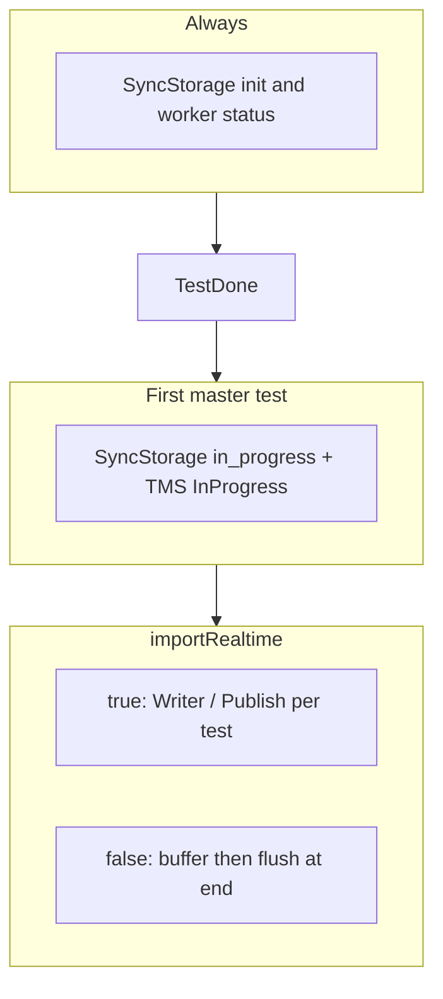

# importRealtime — specification of implemented changes

Feature: configurable import mode for Test IT .NET adapters (2.0+).  
Reference implementation: [adapters-python `AdapterManager.write_test`](https://github.com/testit-tms/adapters-python/blob/main/testit-python-commons/src/testit_python_commons/services/adapter_manager.py).

Planning notes (not maintained as a spec): [importRealtime_plan.md](./importRealtime_plan.md).

## Purpose

`importRealtime` controls **when** autotest results are published to the test run in TMS. It does **not** disable Sync Storage.

| `importRealtime` | Default | Behavior |
|------------------|---------|----------|
| `true` | yes | Publish each result to the test run as soon as the test finishes (legacy behavior). |
| `false` | no | Buffer results during the run; publish to the test run at the end (bulk flush). |

**Always (both modes):**

- Sync Storage subprocess / connection on port `49152` (or `syncStoragePort`).
- Worker status: `in_progress` at run start, `completed` at run end.
- First master test: cut-model to Sync Storage + TMS test result with **InProgress** status (single reserved slot, atomic in `SyncStorageRunner`).

## Configuration

### Property

| Source | Key | Type | Default |
|--------|-----|------|---------|
| `Tms.config.json` | `importRealtime` | `bool` | `true` |
| Environment | `TMS_IMPORT_REALTIME` | `true` / `false` | unset → `true` |
| TmsRunner CLI | `--tmsImportRealtime` | string | optional |

### Code locations

- Core: `Tms.Adapter.Core/Configurator/TmsSettings.cs`, `Configurator.cs` (`ApplyEnv`)
- TmsRunner: `TmsRunner/Entities/TmsSettings.cs`, `EnvConfigurationProvider.cs`, `ClassConfigurationProvider.cs`, `AdapterConfig.cs`, `Config.cs`

### Example `Tms.config.json`

```json
{
  "url": "https://tms.example.com",
  "privateToken": "...",
  "projectId": "...",
  "configurationId": "...",
  "testRunId": "...",
  "importRealtime": true,
  "syncStoragePort": 49152
}
```

User-facing tables: root `README.md`, `Tms.Adapter/README.md`, `Tms.Adapter.XUnit/README.md`, `Tms.Adapter.SpecFlowPlugin/README.md`.

## Runtime behavior



### `importRealtime = false`

1. First test (master, no in-progress yet): in-progress path only; no buffer entry for that test.
2. Other tests: stored in memory; **no** TMS publish until flush.
3. End of run: flush all buffered items, then set worker `completed`.

### `importRealtime = true`

1. First test: in-progress path if Sync Storage succeeds; **no** immediate final-status write for that test (same as before).
2. Other tests: full create/update autotest + submit to test run immediately after each test.

## Component changes

### Tms.Adapter.Core — XUnit, SpecFlow

**File:** `Tms.Adapter.Core/Service/AdapterManager.cs`

| Addition | Description |
|----------|-------------|
| `_importRealtime` | From config at construction |
| `_bufferedTestCases` | `List<(TestContainer, ClassContainer)>` under `_writeLock` |
| `WriteTestCase` | After optional in-progress: realtime → `_writer.Write`; bulk → append to buffer |
| `FlushBufferedTestCases()` | Public; sequential `Writer.Write` for each buffered pair; no-op if realtime |
| `OnBlockCompleted()` | Calls `FlushBufferedTestCases()` then `SetWorkerStatus("completed")` |

**Lifecycle:** SpecFlow `TmsBindings.AfterTestRun` calls `OnBlockCompleted()` (flush inside).

**XUnit caveat:** `ITestAssemblyFinished` is not delivered to per-test `TmsMessageBus` (only `IMessageBus` is wrapped). With `importRealtime=false`, buffered results are flushed in `TmsXunitHelper.FinishTestCase` after each test; `ProcessExit` still calls `OnBlockCompleted` for worker `completed`.

**Bulk publish:** sequential `Writer.Write` per buffered test (no `create_multiple` / bulk TMS API in this release).

### TmsRunner — MSTest / NUnit

**File:** `TmsRunner/Services/ProcessorService.cs`

| Method | Role |
|--------|------|
| `ProcessAutoTestAsync` | `true` → `PublishAutoTestAsync(..., allowInProgress: true)`; `false` → `TryPublishInProgressAsync` or buffer `TestResult` |
| `FlushBufferedTestResultsAsync` | End-of-run flush via `PublishAutoTestAsync(..., allowInProgress: false)` |
| `TryPublishInProgressAsync` | First-test in-progress only (create/update autotest + InProgress submit) |
| `PublishAutoTestAsync` | Shared publish pipeline |

**File:** `TmsRunner/App.cs` — in `finally`, before `SyncStorageSession.ShutdownAsync()`:

```csharp
await processorService.FlushBufferedTestResultsAsync();
await syncStorageSession.ShutdownAsync();
```

**DI:** `ProcessorService` registered as **Singleton** in `TmsRunner/Program.cs` so `RunEventHandler` and `App` share the same buffer.

**Note:** `Tms.Adapter` (Fody) only emits step/trace messages to stdout; import mode is enforced in TmsRunner + Core.

### Unchanged

- `SyncStorageRunner`, `SyncStorageSession`, in-progress reservation (`Interlocked.CompareExchange`).
- `TMS_DISABLE_NETWORK=true` for tests (no HTTP, no Sync Storage subprocess).
- MSTest/NUnit trace parsing and step model building.

## Tests added

| File | Coverage |
|------|----------|
| `Tms.Adapter.CoreTests/Configurator/ConfiguratorTests.cs` | Default `false`; env `TMS_IMPORT_REALTIME=true` |
| `Tms.Adapter.CoreTests/Service/AdapterManagerImportRealtimeTests.cs` | Buffer + flush with `TMS_DISABLE_NETWORK=true` |

## Regression checklist

- [ ] `importRealtime=false`: first result in test run is InProgress; remaining results appear after run completes.
- [ ] `importRealtime=true`: results appear during the run (except first stays InProgress until updated by later flow / TMS).
- [ ] Parallel XUnit: only one in-progress send; writes serialized via `_writeLock`.
- [ ] CI with external Sync Storage: worker sync and `wait-completion` still apply.
- [ ] Local / SpecFlow tests with `TMS_DISABLE_NETWORK=true` pass without network.

## Related docs

- Sync Storage hardening: [../tech-docs/syncstorage-xunit-specflow-hardening.md](../tech-docs/syncstorage-xunit-specflow-hardening.md)
- Release notes (2.0): [../README.md](../README.md#whats-new-in-200)
