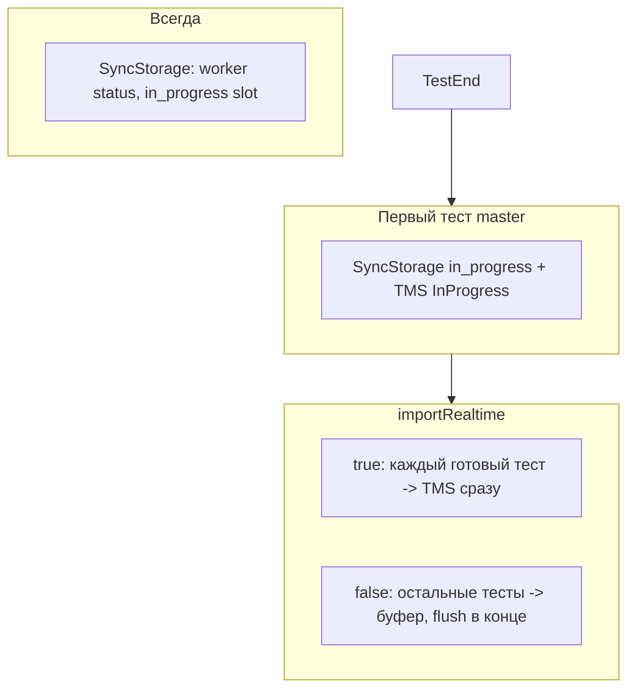

# Поддержка importRealtime в adapters-dotnet

## Уточнённая модель (по вашему комментарию)



| `importRealtime` | Sync Storage | Первый тест | Остальные тесты |
|------------------|--------------|-------------|-----------------|
| `false` (default) | всегда | InProgress в прогон (как сейчас) | буфер, публикация в конце прогона |
| `true` | всегда | InProgress (как сейчас) | публикация сразу после завершения теста |

**Референс:** [adapters-python `AdapterManager.write_test`](https://github.com/testit-tms/adapters-python/blob/main/testit-python-commons/src/testit_python_commons/services/adapter_manager.py) — при `false` результаты кладутся в `__test_results`, при `true` вызывается `_write_test_realtime_internal`; Sync Storage не отключается.

## Текущее состояние репозитория

- Свойство `importRealtime` **отсутствует** в [`Tms.Adapter.Core/Configurator/TmsSettings.cs`](Tms.Adapter.Core/Configurator/TmsSettings.cs) и [`TmsRunner/Entities/TmsSettings.cs`](TmsRunner/Entities/TmsSettings.cs).
- [`AdapterManager.WriteTestCase`](Tms.Adapter.Core/Service/AdapterManager.cs) **всегда** вызывает `_writer.Write` сразу (фактически режим `true`).
- [`ProcessorService.ProcessAutoTestAsync`](TmsRunner/Services/ProcessorService.cs) отправляет каждый результат сразу (плюс in-progress для первого).
- README 2.0 обещает default `false`, но batch-режим в .NET **не реализован** — его нужно добавить, не ломая существующий in-progress + Sync Storage.

## Архитектура изменений

### 1. Конфигурация (общая для всех адаптеров)

**Core** — [`TmsSettings`](Tms.Adapter.Core/Configurator/TmsSettings.cs):
```csharp
public bool ImportRealtime { get; set; } // default: false
```

**Core** — [`Configurator.ApplyEnv`](Tms.Adapter.Core/Configurator/Configurator.cs):
- `TMS_IMPORT_REALTIME` → `ImportRealtime` (как у других bool-полей).

**TmsRunner** — зеркально в [`TmsRunner/Entities/TmsSettings.cs`](TmsRunner/Entities/TmsSettings.cs), [`EnvConfigurationProvider`](TmsRunner/Entities/Configuration/EnvConfigurationProvider.cs), [`ClassConfigurationProvider`](TmsRunner/Entities/Configuration/ClassConfigurationProvider.cs), [`AdapterConfig`](TmsRunner/Entities/Configuration/AdapterConfig.cs) / [`Config`](TmsRunner/Entities/Configuration/Config.cs): CLI `--tmsImportRealtime`, env `TMS_IMPORT_REALTIME`, JSON `importRealtime`.

**Документация** (таблицы + пример `Tms.config.json`):
- [`README.md`](README.md)
- [`Tms.Adapter/README.md`](Tms.Adapter/README.md)
- [`Tms.Adapter.XUnit/README.md`](Tms.Adapter.XUnit/README.md)
- [`Tms.Adapter.SpecFlowPlugin/README.md`](Tms.Adapter.SpecFlowPlugin/README.md)

### 2. Tms.Adapter.Core — XUnit / SpecFlow

Файл: [`AdapterManager.cs`](Tms.Adapter.Core/Service/AdapterManager.cs)

- Поле `_importRealtime` из конфига конструктора.
- Буфер: `List<(TestContainer, ClassContainer)>` под lock `_writeLock`.
- **`WriteTestCase`**:
  - **Общее (оба режима):** если master и слот свободен → `TrySendToSyncStorageAndWriteInProgress` (без изменений логики Sync Storage).
  - **`ImportRealtime == true`:** после in-progress / fallback → сразу `_writer.Write` (текущее поведение).
  - **`ImportRealtime == false`:** если in-progress уже отработал для этого вызова → `return`; иначе **добавить в буфер**, **не** вызывать `_writer.Write`.
- **`FlushBufferedTestCases()`** (public): в конце прогона записать все буферизованные пары (см. п. 3), очистить буфер.
- **`OnBlockCompleted`:** порядок как в Python — сначала `FlushBufferedTestCases()` (если `!ImportRealtime`), затем `SetWorkerStatus("completed")`.

**Точки вызова flush:**
- XUnit: [`TmsXunitHelper.OnRunFinished`](Tms.Adapter.XUnit/TmsXunitHelper.cs) — `FlushBufferedTestCases()` перед `OnBlockCompleted`.
- SpecFlow: [`TmsBindings.AfterTestRun`](Tms.Adapter.SpecFlowPlugin/TmsBindings.cs) — то же.

Sync Storage init в конструкторе **не трогаем** — `InitializeSyncStorage` остаётся при включённой сети.

### 3. Пакетная запись (importRealtime = false)

Минимально достаточный вариант для «собрать, потом опубликовать»:
- На flush вызывать существующий [`Writer.Write`](Tms.Adapter.Core/Writer/Writer.cs) для каждой пары из буфера (последовательно, под тем же `_writeLock`).

Опционально (если в `TestIt.ApiClient` 5.5.6-TMS-5.7 есть bulk-методы — проверить при реализации):
- Вынести в `TmsClient` метод `WriteTestsBulk(...)` по аналогии с Python `BulkAutotestHelper` (`create_multiple` / `update_multiple` + batch results), чтобы снизить число HTTP-запросов на больших прогонах.

### 4. TmsRunner — MSTest/NUnit

**Буферизация на время прогона** ([`ProcessorService`](TmsRunner/Services/ProcessorService.cs)):
- `ImportRealtime == true`: оставить текущий `ProcessAutoTestAsync` (in-progress для первого + финальный submit).
- `ImportRealtime == false`:
  - Первый тест (master, `!IsAlreadyInProgress`): in-progress через Sync Storage + submit с `forceInProgressStatus: true`, **без** добавления в буфер.
  - Остальные: **не** дергать TMS API — сохранить подготовленные данные (достаточно `TestResult` или уже собранной модели) в `ConcurrentBag`/список в `ProcessorService`.

**Flush в конце** ([`App.RunAsync`](TmsRunner/App.cs)):
- После `RunSelectedTestsAsync` / reruns, **до** `syncStorageSession.ShutdownAsync()`:
  - если `!ImportRealtime` → обработать буфер (полный pipeline create/update/submit **без** in-progress ветки).

[`RunEventHandler`](TmsRunner/Handlers/RunEventHandler.cs) менять не обязательно — достаточно изменить поведение внутри `ProcessAutoTestAsync` + flush в `App`.

Sync Storage в [`SyncStorageSession`](TmsRunner/Services/SyncStorageSession.cs) **всегда** стартует при наличии `TestRunId` (как сейчас).

### 5. Тесты

| Область | Что проверить |
|---------|----------------|
| [`ConfiguratorTests`](Tms.Adapter.CoreTests/Configurator/ConfiguratorTests.cs) | `TMS_IMPORT_REALTIME=true/false` |
| Новые unit-тесты `AdapterManager` (с `TMS_DISABLE_NETWORK=true`) | при `false` — `WriteTestCase` не пишет в API, flush вызывает write; при `true` — write сразу |
| `ProcessorService` / TmsRunner (если есть инфраструктура моков) | буфер vs немедленная отправка |

Существующие [`SyncStorageRunnerTests`](Tms.Adapter.CoreTests/SyncStorage/SyncStorageRunnerTests.cs) не трогать.

### 6. Регрессии — что не ломаем

- In-progress + Sync Storage для **первого** теста в обоих режимах.
- `TMS_DISABLE_NETWORK=true` в тестах SpecFlow (без сети и без subprocess).
- Параллельный XUnit: `_writeLock` + atomic reservation в [`SyncStorageRunner`](Tms.Adapter.Core/SyncStorage/SyncStorageRunner.cs).
- Поведение при `importRealtime=false` после внедрения: batch в конце; при `true` — как сейчас (immediate write).

## Затрагиваемые компоненты

| Компонент | Изменения |
|-----------|-----------|
| `Tms.Adapter.Core` | Config, `AdapterManager`, опционально bulk в `TmsClient` |
| `Tms.Adapter.XUnit` | flush в `OnRunFinished` |
| `Tms.Adapter.SpecFlowPlugin` | flush в `AfterTestRun` |
| `TmsRunner` | config + `ProcessorService` + `App` flush |
| README × 4 | `importRealtime`, `syncStoragePort` где ещё нет |

MSTest/NUnit DLL ([`Tms.Adapter`](Tms.Adapter)) только пишет в stdout — логика режима целиком в Core (через runner) + TmsRunner.
