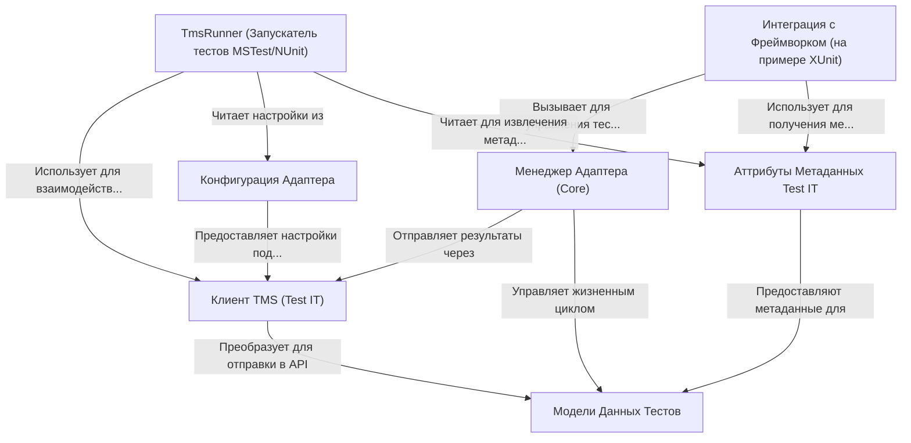

# Tutorial: adapters-dotnet

Этот проект представляет собой набор **адаптеров** для .NET, позволяющих интегрировать автоматические тесты с системой управления тестированием **Test IT**. Он включает компоненты ядра (такие как *Клиент TMS* и *Менеджер Адаптера*), поддержку различных тестовых фреймворков (например, *XUnit*, *SpecFlow* через механизм **интеграции**) и отдельный запускатель (**TmsRunner**) для *MSTest/NUnit*. Разработчики используют специальные **атрибуты**, чтобы связать код теста с сущностями в Test IT. Адаптеры собирают *данные о тестах* и их результатах во время выполнения и отправляют их в Test IT, используя настройки из **конфигурации**.

**Source Repository:** [https://github.com/testit-tms/adapters-dotnet](https://github.com/testit-tms/adapters-dotnet)

## Chapters

1. [Конфигурация Адаптера
](01_конфигурация_адаптера_.md)
2. [Аттрибуты Метаданных Test IT
](02_аттрибуты_метаданных_test_it_.md)
3. [Интеграция с Фреймворком (на примере XUnit)
](03_интеграция_с_фреймворком__на_примере_xunit__.md)
4. [Менеджер Адаптера (Core)
](04_менеджер_адаптера__core__.md)
5. [Клиент TMS (Test IT)
](05_клиент_tms__test_it__.md)
6. [Модели Данных Тестов
](06_модели_данных_тестов_.md)
7. [TmsRunner (Запускатель тестов MSTest/NUnit)
](07_tmsrunner__запускатель_тестов_mstest_nunit__.md)

---

Generated by [AI Codebase Knowledge Builder](https://github.com/The-Pocket/Tutorial-Codebase-Knowledge)