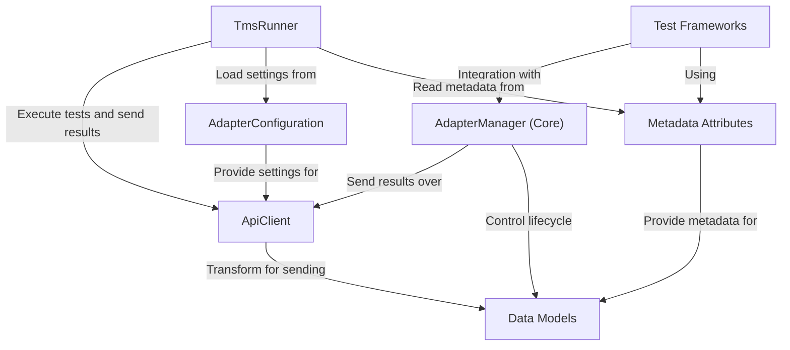

# Tutorial: adapters-dotnet

Этот проект представляет собой набор **адаптеров** для .NET, позволяющих интегрировать автоматические тесты с системой управления тестированием **Test IT**. 

Проект включает в себя:
- Компоненты ядра (Tms.Adapter.Core): *Клиент TMS*, *Менеджер Адаптера*, модели данных и атрибуты метаданных
- Поддержку различных тестовых фреймворков:
  - MSTest и NUnit (через Tms.Adapter)
  - XUnit (через Tms.Adapter.XUnit)
  - SpecFlow (через Tms.Adapter.SpecFlowPlugin)
- Отдельный запускатель тестов TmsRunner для MSTest/NUnit

Все компоненты поддерживают последние версии Test IT (Cloud, 5.5, 5.4, 5.3 и более ранние версии) - подробности см. в таблице совместимости в основном README.

Разработчики используют специальные **атрибуты**, чтобы связать код теста с сущностями в Test IT. Адаптеры собирают *данные о тестах* и их результатах во время выполнения и отправляют их в Test IT, используя настройки из **конфигурации**.

**Source Repository:** [https://github.com/testit-tms/adapters-dotnet](https://github.com/testit-tms/adapters-dotnet)

## Chapters

1. [Конфигурация Адаптера](01_конфигурация_адаптера_.md)
2. [Атрибуты Метаданных Test IT](02_Атрибуты_метаданных_test_it_.md)
3. [Интеграция с Фреймворком (на примере XUnit)](03_интеграция_с_фреймворком__на_примере_xunit__.md)
4. [Менеджер Адаптера (Core)](04_менеджер_адаптера__core__.md)
5. [Клиент TMS (Test IT)](05_клиент_tms__test_it__.md)
6. [Модели Данных Тестов](06_модели_данных_тестов_.md)
7. [TmsRunner (Запускатель тестов MSTest/NUnit)](07_tmsrunner.md)

---
Generated by [AI Codebase Knowledge Builder](https://github.com/The-Pocket/Tutorial-Codebase-Knowledge)